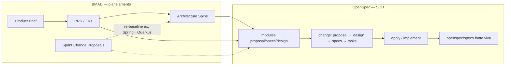
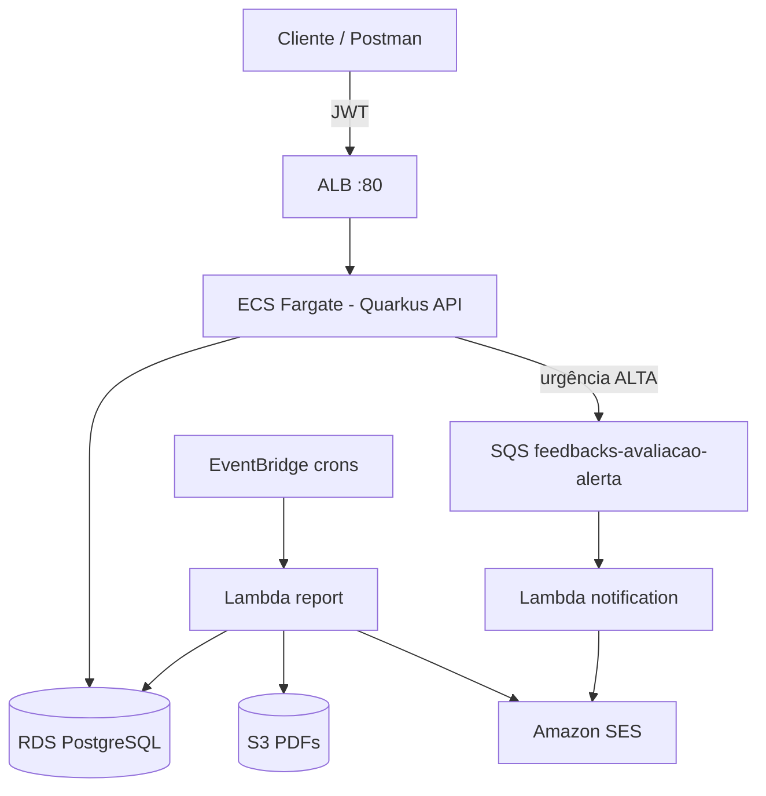
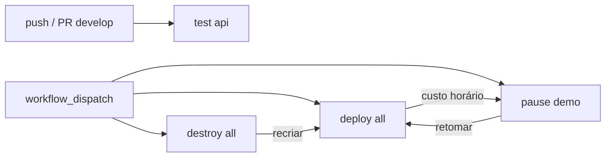

# ☁️ Tech Challenge - Fase 4 (FIAP)


Este repositório contém a entrega do Tech Challenge da Fase 4 (**Cloud Computing, Serverless e Deploy**). O projeto é uma plataforma de captura e triagem de feedbacks de aulas, com API na AWS, efeitos serverless (alerta de urgência + relatórios) e esteiras de ciclo de vida da demo no GitHub Actions.

O desenvolvimento seguiu o paradigma **SDD (Spec-Driven Development)**, combinando **BMAD** (planejamento e arquitetura) com **OpenSpec** (especificação executável e mudanças incrementais).

Desenvolvimento solo por **Thiago Ferreira**.

## 📐 BMAD + OpenSpec (paradigma SDD)

A entrega não começou pelo código: primeiro o **quê** e o **porquê** (BMAD), depois o **como** em specs versionadas (OpenSpec), e só então a implementação — com a spec como fonte de verdade.



### BMAD — o quê construir e sob quais decisões

Usado na fase de **Analysis → Planning → Solutioning** (agentes/skills BMad Method):

| Artefato | Pasta | Papel no SDD |
|----------|-------|--------------|
| **Product Brief** | [`_bmad-output/planning-artifacts/briefs/`](_bmad-output/planning-artifacts/briefs/) | Problema, escopo e valor |
| **PRD** | [`_bmad-output/planning-artifacts/prds/`](_bmad-output/planning-artifacts/prds/) | FRs, NFRs, user journeys, critérios de aceite |
| **Architecture Spine** | [`_bmad-output/planning-artifacts/architecture/`](_bmad-output/planning-artifacts/architecture/) | ADs (Quarkus, hexagonal, AWS, JaCoCo ≥ 90%, etc.) — contexto injetado no OpenSpec |
| **Sprint Change Proposals** | [`_bmad-output/planning-artifacts/`](_bmad-output/planning-artifacts/) | Mudanças de curso (ex.: re-baseline Spring → Quarkus) sem invalidar o PRD |

Skills como `bmad-prd`, `bmad-create-architecture`, `bmad-correct-course`, `bmad-dev-story` / `bmad-quick-dev` orientaram planejamento, revisão adversarial e implementação alinhada aos artefatos.

### OpenSpec — especificar antes de codificar

Schema do projeto: **`spec-driven`** ([`openspec/config.yaml`](openspec/config.yaml)). O OpenSpec transforma o PRD/arquitetura em **contratos de capacidade** e em **changes** implementáveis.

| Camada | Pasta | Uso |
|--------|-------|-----|
| **Módulos** | [`openspec/modules/`](openspec/modules/) | Capabilidades do domínio (`01` auth … `06` relatórios): `proposal.md` + `specs.md` + `design.md`, amarrados a FRs do PRD |
| **Changes** | [`openspec/changes/`](openspec/changes/) (ativos) e [`archive/`](openspec/changes/archive/) | Ciclo SDD: **propose → design → specs → tasks → apply → archive** |
| **Specs vivas** | [`openspec/specs/`](openspec/specs/) | Requisitos canônicos após o archive (ex.: `auth-login`, `avaliacao-urgencia`, `alerta-notificacao-ses`) |

Fluxo típico de uma feature:

1. **Propose** (`openspec-propose`) — cria a change com proposal, design, specs delta e tasks  
2. **Apply** (`openspec-apply-change`) — implementa task a task contra a spec (código + testes + JaCoCo)  
3. **Archive** — promove o delta para `openspec/specs/` e guarda o histórico em `changes/archive/`

Assim, login JWT, catálogo, inscrição, avaliação, alerta SES e relatórios nasceram de specs — não de implementação ad hoc.

### Como os dois se complementam

| | **BMAD** | **OpenSpec** |
|---|----------|--------------|
| Horizonte | Produto e arquitetura (macro) | Change / capacidade (micro) |
| Pergunta | *O que* e *por quê*? Quais ADs? | *Como* esta mudança se comporta (Given/When/Then)? |
| Saída | Brief, PRD, Spine, SCP | Modules, changes, specs vivas |
| Quando muda a stack | SCP + update do Spine | Re-baseline de `design.md` / change (ex. módulo 01 Quarkus) |

## 🏛️ Arquitetura do Sistema

API Quarkus em ECS Fargate atrás de ALB, persistência em RDS PostgreSQL e efeitos assíncronos via SQS/Lambda (alerta SES) e EventBridge/Lambda (relatórios HTML + PDF no S3).



**Regra de urgência:** nota ≤ 4 → `ALTA`; ≤ 7 → `MEDIA`; senão → `BAIXA`. Avaliação `ALTA` publica na fila SQS após o commit.

## 🛠️ Tecnologias Utilizadas

- **Linguagem e runtime:** Java 17, Quarkus 3.33 LTS
- **API:** REST (`/api/v1`), SmallRye JWT, Flyway, Hibernate ORM
- **Serverless:** AWS Lambda (Quarkus), SQS + DLQ, EventBridge, SES, S3
- **Compute / rede:** ECS Fargate, ALB, ECR, CloudWatch Alarm (5XX)
- **Persistência:** PostgreSQL (local + RDS `feedbacks-demo`)
- **IaC:** AWS CDK v2 (Java / Maven) — 3 stacks
- **Qualidade:** JUnit 5, AssertJ, JaCoCo gate ≥ 90% linha
- **CI/CD:** GitHub Actions (`test`, `deploy`, `pause`, `destroy`)
- **Método (SDD):** BMAD (Brief / PRD / Architecture) + OpenSpec (modules / changes / specs)

## 📁 Estrutura do Repositório

```text
projeto/
├── docs/                         # Enunciado, Postman, roteiros
├── feedbacks/
│   ├── apps/
│   │   ├── api/                  # Monólito Quarkus (REST + JWT)
│   │   ├── notification/         # Lambda alerta → SES
│   │   └── report/               # Lambda relatórios → SES + S3
│   └── infra/                    # CDK Java + scripts de ciclo de vida
├── openspec/                     # SDD: modules, specs vivas, changes
├── _bmad-output/                 # Brief, PRD, Architecture Spine, SCPs
└── .github/workflows/            # Esteiras CI/CD
```

## 🚀 Como Executar Localmente

### 1. Pré-requisitos

- Java 17 (JDK)
- Maven
- Docker (apenas para o PostgreSQL)
- (Opcional) IntelliJ — guia em [`docs/como-rodar-intellij.md`](docs/como-rodar-intellij.md)

### 2. Subir o PostgreSQL

```bash
docker run --name feedbacks-postgres \
  -e POSTGRES_USER=feedbacks \
  -e POSTGRES_PASSWORD=feedbacks \
  -e POSTGRES_DB=feedbacks \
  -p 5432:5432 \
  -d postgres:16
```

### 3. Subir a API (Quarkus Dev Mode)

```bash
cd feedbacks/apps/api
mvn quarkus:dev
```

API em `http://localhost:8080` (profile `local`). O Flyway aplica o schema e o seed de usuários na primeira subida.

### 4. Usuários demo

| Papel | E-mail | Senha |
|-------|--------|-------|
| ESTUDANTE | `estudante@demo.fiap` | `senha123` |
| ADMINISTRADOR | `admin@demo.fiap` | `admin123` |

### 5. Health check

```bash
curl -s http://localhost:8080/api/v1/health
```

## 🧪 Como Testar a Aplicação

### Postman (fluxo completo)

Na pasta `docs/postman`:

| Arquivo | Uso |
|---------|-----|
| `feedbacks-api.postman_collection.json` | Collection (Health, Auth, Cursos, Aulas, Avaliações) |
| `feedbacks-api.local.postman_environment.json` | `baseUrl=http://localhost:8080` |
| `feedbacks-api.aws-alb.postman_environment.json` | Ambiente AWS (atualize o `baseUrl` com o ALB do deploy) |

**Fluxo feliz:**
1. **Auth** → Login (token salvo em `accessToken`)
2. **Cursos / Aulas** → catalogar e consultar
3. **Inscrições** → estudante se matricula
4. **Avaliações** → POST com `nota` (ex.: `3` dispara alerta `ALTA` na AWS)

### Testes automatizados (Maven)

```bash
# API — unit + @QuarkusTest + Dev Services + gate JaCoCo ≥ 90%
cd feedbacks/apps/api && mvn -B verify

# Lambdas
cd feedbacks/apps/notification && mvn -B verify
cd feedbacks/apps/report && mvn -B verify
```

Relatório HTML: `feedbacks/apps/api/target/jacoco-report/`.

### AWS — relatório sob demanda

```bash
aws lambda invoke \
  --function-name feedbacks-lambda-report \
  --cli-binary-format raw-in-base64-out \
  --payload '{"periodo":"semanal"}' \
  /tmp/report-semanal.json
```

Roteiro de vídeo da demo: [`docs/ROTEIRO-DEMO.md`](docs/ROTEIRO-DEMO.md).

## ☁️ Deploy na AWS (demo)

Região usada pelas esteiras e scripts: **`us-east-1`**.

| Stack CDK | Recursos |
|-----------|----------|
| `FeedbacksAlertaNotificationStack` | SQS + DLQ → Lambda notification → SES |
| `FeedbacksRelatorioStack` | EventBridge diário/semanal → Lambda report → S3 + SES |
| `FeedbacksApiStack` | ECR + ECS Fargate + ALB + alarme 5XX |

Extras de demo (via script, não só CDK): RDS `feedbacks-demo`, Secrets Manager (`feedbacks/db`, `feedbacks/jwt`, `feedbacks/adminEmail`).

Após o deploy, o health fica em:

```text
GET http://<ApiAlbDns>/api/v1/health
```

O DNS do ALB sai no **Job Summary** do workflow `deploy(all)` (e nos outputs CDK). Detalhes de IaC: [`feedbacks/infra/README.md`](feedbacks/infra/README.md).

## ⚙️ Esteiras GitHub Actions

As esteiras cobrem **qualidade** e **ciclo de vida da demo** (subir, pausar custo, destruir). Disparo manual em **Actions → &lt;workflow&gt; → Run workflow**, exceto o `test(api)` que também roda em push/PR.



| Workflow | Arquivo | Disparo | O que faz |
|----------|---------|---------|-----------|
| **`test(api)`** | [`.github/workflows/test-api.yml`](.github/workflows/test-api.yml) | `push` / `pull_request` em `develop` (paths `feedbacks/apps/api/**`) + manual | `mvn verify` na API; gate JaCoCo ≥ 90%; sobe artefato HTML; comenta cobertura no PR |
| **`deploy(all)`** | [`.github/workflows/deploy-all.yml`](.github/workflows/deploy-all.yml) | Manual (`run_seed`, `enable_crons`) | Bootstrap CDK → RDS → secrets → package Lambdas → `cdk deploy` das 3 stacks → habilita crons → smoke health no ALB → seed SQL opcional → summary com `ApiAlbDns` |
| **`pause(demo)`** | [`.github/workflows/pause-demo.yml`](.github/workflows/pause-demo.yml) | Manual | Desliga crons EventBridge, destroy da `FeedbacksApiStack` (sem ALB/ECS), **stop** do RDS — corta custo horário; mantém Lambdas/SQS/S3/secrets |
| **`destroy(all)`** | [`.github/workflows/destroy-all.yml`](.github/workflows/destroy-all.yml) | Manual (digitar `destroy`) | Remove stacks Feedbacks*; opcionalmente apaga RDS e/ou secrets |

`deploy` / `pause` / `destroy` compartilham o concurrency group `demo-lifecycle` (não cancelam uns aos outros no meio).

### Secrets do repositório

| Secret | Usado por | Obrigatório |
|--------|-----------|-------------|
| `AWS_ACCESS_KEY_ID` | deploy, pause, destroy | Sim |
| `AWS_SECRET_ACCESS_KEY` | deploy, pause, destroy | Sim |
| `AWS_ACCOUNT_ID` | deploy (bootstrap / CDK) | Sim |
| `FEEDBACKS_ADMIN_EMAIL` | deploy (SES) | Não — cai no 1º e-mail verificado no SES |
| `FEEDBACKS_SQS_ALERT_QUEUE_URL` | deploy (ApiStack) | Não — pode ser preenchido após o 1º deploy da stack de alerta |

`test(api)` **não** precisa de secrets AWS (usa Quarkus Dev Services / Testcontainers no runner).

### Ciclo recomendado da demo

1. **Subir / retomar:** Actions → **`deploy(all)`** → Run workflow  
2. **Demonstrar:** Postman com env AWS ALB + roteiro [`docs/ROTEIRO-DEMO.md`](docs/ROTEIRO-DEMO.md)  
3. **Pausar custo:** Actions → **`pause(demo)`**  
4. **Apagar tudo:** Actions → **`destroy(all)`** (confirmar digitando `destroy`)

Script local equivalente: [`feedbacks/infra/scripts/demo-lifecycle.sh`](feedbacks/infra/scripts/demo-lifecycle.sh).

## 📚 Documentação adicional

| Documento | Conteúdo |
|-----------|----------|
| [`docs/ROTEIRO-DEMO.md`](docs/ROTEIRO-DEMO.md) | Roteiro da demo (FR-16) |
| [`docs/como-rodar-intellij.md`](docs/como-rodar-intellij.md) | Setup local / IntelliJ |
| [`feedbacks/infra/README.md`](feedbacks/infra/README.md) | Stacks CDK, secrets, invoke |
| [`feedbacks/apps/report/UJ4-ROTEIRO.md`](feedbacks/apps/report/UJ4-ROTEIRO.md) | Relatórios sob demanda |
| [`docs/ADJT - Fase 4 - Tech Challenge_rev.pdf`](docs/ADJT%20-%20Fase%204%20-%20Tech%20Challenge_rev.pdf) | Enunciado oficial |
| [`_bmad-output/planning-artifacts/`](_bmad-output/planning-artifacts/) | BMAD: Brief, PRD, Architecture Spine, SCPs |
| [`openspec/`](openspec/) | OpenSpec SDD: `config.yaml`, modules, specs, changes |
