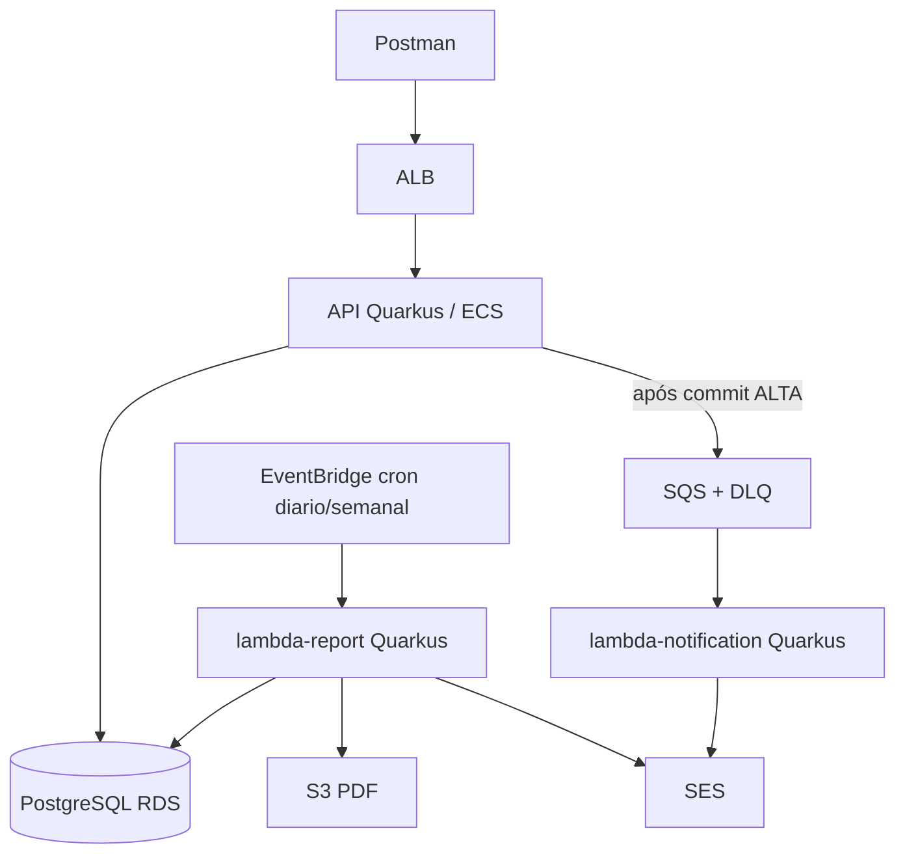
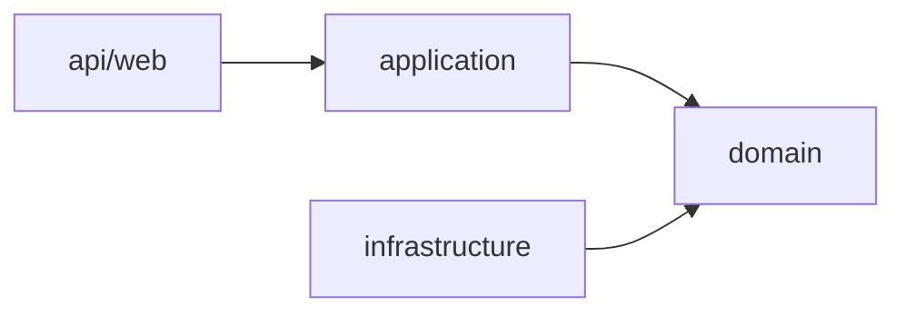
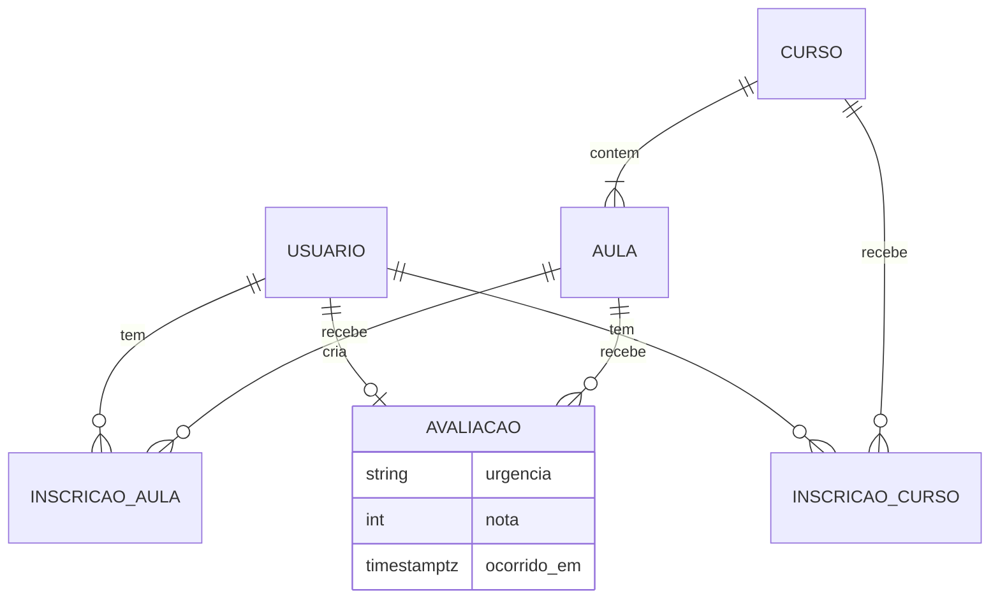
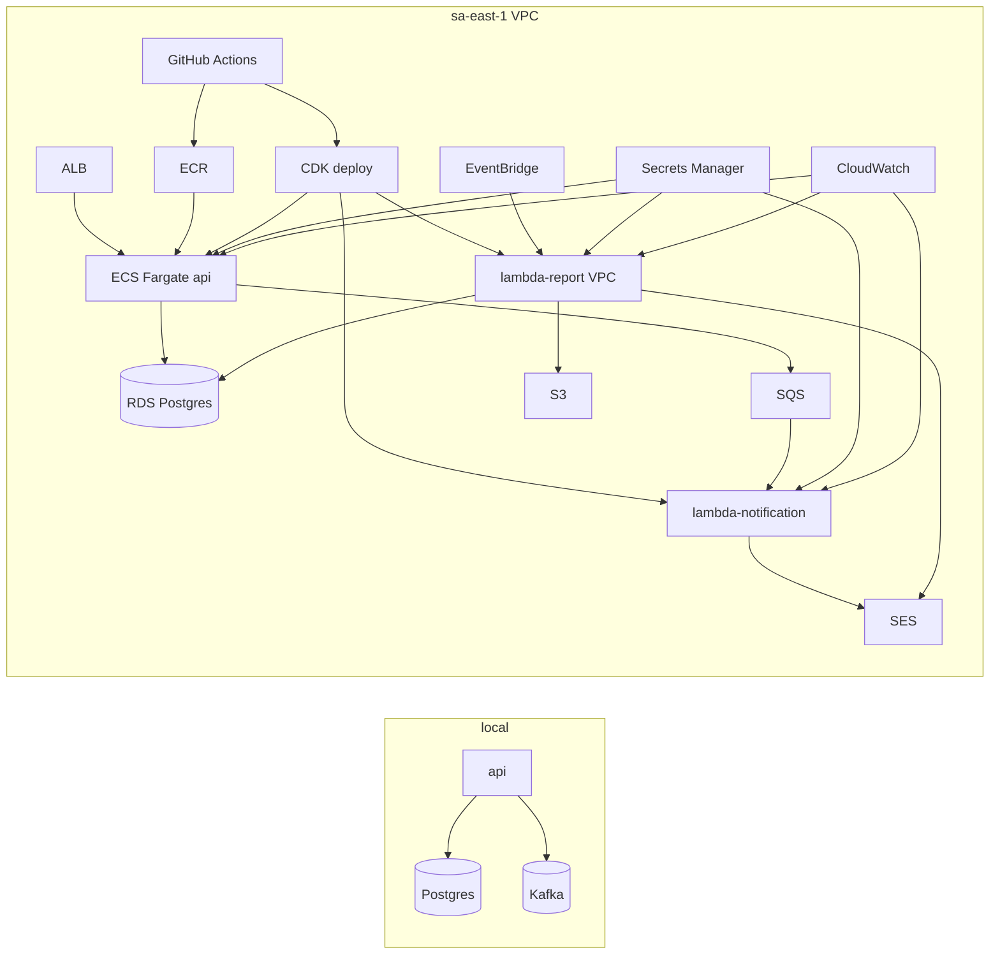

# Architecture Spine — Plataforma de Feedbacks FIAP

## Design Paradigm

**Modular Monolith Layered + Async Side Effects**

| Camada / unidade | Responsabilidade | Deploy |
| --- | --- | --- |
| `api` (web) | HTTP, JWT, DTOs de borda | ECS Fargate atrás de ALB |
| `application` | casos de uso / orquestração transacional | mesmo JAR |
| `domain` | regras (Urgência, inscrição, unicidade Avaliação) | mesmo JAR |
| `infrastructure` | JPA (Hibernate ORM), SQS/Kafka adapter, Security, Secrets, SmallRye Health | mesmo JAR |
| `lambda-notification` | Quarkus + quarkus-amazon-lambda: SQS → SES (SRP alerta) | Lambda (sem VPC) |
| `lambda-report` | Quarkus + quarkus-amazon-lambda: EventBridge → agrega → PDF S3 + SES | Lambda (VPC) |

Capacidades **síncronas** (FR-1–FR-8, FR-13) vivem só no monólito. Efeitos **assíncronos** (FR-10–FR-12, FR-17) vivem só nas Lambdas.



## Invariants & Rules

### AD-1 — Paradigma e modelo cloud `[ADOPTED]`

- **Binds:** all
- **Prevents:** API REST hospedada em API Gateway+Lambda; um microserviço por agregado; MSK em produção
- **Rule:** API de negócio = **um** deployable Quarkus em **ECS Fargate** (+ ALB); alerta e relatório = **Lambdas SRP**; PDF = **S3**; e-mail = **SES**; região **`sa-east-1`**; sizing demo = ECS **0.25 vCPU**, RDS **db.t3.micro** single-AZ; alvo custo ~USD 20–30/mês

### AD-2 — Direção de dependência (API)

- **Binds:** módulo `api`
- **Prevents:** `domain` depender de JAX-RS/Hibernate; controllers acessarem repositórios diretamente
- **Rule:** dependências de código só `api → application → domain ← infrastructure`; casos de uso orquestram portas; adapters implementam portas (wiring CDI/ArC não cria dependência de pacote `web → infra`)



### AD-3 — Ownership de escrita do domínio

- **Binds:** Curso, Aula, Inscrição, Avaliação, Usuário
- **Prevents:** Lambda ou job externo criando/alterando Avaliação (ou demais entidades de negócio)
- **Rule:** **única writer** = API; Lambdas são **read-only** no domínio (relatório) ou **stateless** no payload (alerta)

### AD-4 — Mutação de Avaliação e publicação

- **Binds:** FR-7, FR-9, FR-10
- **Prevents:** e-mail/alerta sem Avaliação persistida; rollback da Avaliação por falha SES/SQS
- **Rule:** na mesma transação: validar inscrição (AD-15) + unicidade Estudante+Aula + persistir + derivar Urgência; **após commit**, se ALTA → publicar na fila; SQS com **DLQ** + retry; falha de publish/SES **não** apaga a Avaliação

### AD-5 — Contrato único do evento de alerta

- **Binds:** FR-10, `lambda-notification`, adapters Kafka/SQS
- **Prevents:** payload local ≠ AWS; Lambda de alerta acoplada ao RDS; campos faltando no e-mail
- **Rule:** **mesmo JSON** (UTF-8) em Kafka local e SQS AWS: `avaliacaoId`, `descricao`, `urgencia`, `ocorridoEm` (ISO-8601 offset), `aulaId`, `cursoId`; Lambda só SES — **sem** query ao banco

### AD-6 — Relatórios: uma Lambda, dois crons, janelas civis

- **Binds:** FR-11, FR-12, FR-17
- **Prevents:** terceira Lambda 1:1 com job; PDF no request path; janelas UTC “rolling” divergentes
- **Rule:** **uma** `lambda-report` com `periodo=diario|semanal`; EventBridge: diário **08:00** `America/Sao_Paulo`; semanal **segunda 08:00** mesmo fuso; janela diária = **dia civil anterior** SP; semanal = **7 dias civis anteriores**; agrega no RDS; SES HTML identifica tipo+período; PDF tabular no S3

### AD-7 — Broker local vs produção

- **Binds:** publicação de eventos
- **Prevents:** MSK em prod; domínio importar cliente Kafka/SQS; schemas distintos por ambiente
- **Rule:** **Kafka** só Compose local; **SQS** em AWS; porta `EvaluationEventPublisher`; adapters serializam o **mesmo** contrato AD-5

### AD-8 — Auth, papéis e matriz de autorização `[ADOPTED]`

- **Binds:** FR-1, FR-2, FR-3, FR-4, FR-8, rotas de negócio
- **Prevents:** autorização só no Postman; papéis sem mapa de rotas; Estudante vendo Avaliações alheias
- **Rule:** JWT **HS256** (secret em Secrets Manager, chave `jwtSecret` — AD-12 intocado) com claim `role` ∈ {`ESTUDANTE`,`ADMINISTRADOR`}; validação via Quarkus Security + SmallRye JWT com `mp.jwt.verify.publickey.algorithm=HS256` explícito (SmallRye privilegia RSA por padrão); emissão via `quarkus-smallrye-jwt-build`; rotas protegidas com `@RolesAllowed`; Lambdas **não** autenticam usuários finais. Matriz: **Admin** cria Curso/Aula e lista **todas** Avaliações; **Estudante** e Admin leem catálogo; **Estudante** inscreve/avalia e lista **só as próprias** Avaliações; criação de Avaliação exige papel Estudante

### AD-9 — Superfície HTTP `[ADOPTED]`

- **Binds:** §9 PRD, OQ-4
- **Prevents:** paths misturados com/sem versão e com acento inconsistente
- **Rule:** prefixo `/api/v1/`; recurso `avaliacoes` (ASCII); login e health públicos; demais rotas `Authorization: Bearer`

### AD-10 — Demo de relatório sem endpoint extra `[ADOPTED]`

- **Binds:** FR-16, OQ-3
- **Prevents:** depender só da cron para gravar o vídeo; endpoint admin só para demo
- **Rule:** disparo manual = **invoke** da `lambda-report` no console AWS (ou CLI) com `periodo`; sem rota admin de relatório no MVP

### AD-11 — Observabilidade mínima

- **Binds:** FR-13, FR-14
- **Prevents:** health “sempre 200” sem dependência; métricas inventadas fora do CloudWatch
- **Rule:** SmallRye Health (`/q/health`) com checagem de DB, exposto em path compatível com o ALB health check; CloudWatch na API: **RequestCount**, **4XX/5XX**, **TargetResponseTime** (ou equivalente ALB/ECS) + **≥1 alarme** (ex.: 5XX > 0 em 5 min); logs com `traceId`/request id

### AD-12 — Segredos, IaC e teardown `[ADOPTED]`

- **Binds:** NFR segurança, SM-4, FR-15
- **Prevents:** secrets no repo/imagem; infra 24/7 pós-nota; Terraform e CDK em paralelo; chaves de secret divergentes entre Lambdas
- **Rule:** infra AWS só via **AWS CDK**; Secrets Manager com chaves canônicas `jwtSecret`, `dbUrl`/`dbUser`/`dbPassword`, `adminEmail`; checklist/script teardown (RDS stop, ECS desired=0, desabilitar EventBridge)

### AD-13 — Lambdas Quarkus / quarkus-amazon-lambda `[ADOPTED — reescrito 2026-07-21 pela Sprint Change Proposal; versão anterior: Spring Boot + Spring Cloud Function]`

- **Binds:** `lambda-notification`, `lambda-report`
- **Prevents:** handlers “plain SDK” divergindo do stack Quarkus; servidor HTTP embutido nas Lambdas
- **Rule:** cada Lambda é app **Quarkus** + **`quarkus-amazon-lambda`**; handler gerenciado pelo Quarkus; **sem** servidor HTTP embutido; packaging `function.zip` padrão Quarkus

### AD-14 — Cobertura unitária JaCoCo ≥ 90% `[ADOPTED]`

- **Binds:** `api`, `lambda-notification`, `lambda-report` (código de produção)
- **Prevents:** módulos sem gate de cobertura; CI verde com testes vazios
- **Rule:** JaCoCo no build (via `quarkus-jacoco`); **line coverage unitária ≥ 90%** por módulo Java de app; pipeline **falha** abaixo do limiar; exclusões só para gerados/bootstrap documentados (ex.: classe main/bootstrap, config pura)

### AD-15 — Inscrição e unicidades de domínio

- **Binds:** FR-5, FR-6, FR-7
- **Prevents:** avaliar sem inscrição; divergência 409 vs idempotência; Avaliação sem Curso
- **Rule:** inscrição em **Curso e Aula** obrigatória antes de Avaliar; Aula deve pertencer ao Curso; duplicata de inscrição ou de Avaliação (Estudante+Aula) → **409**; sem upsert no MVP

### AD-16 — Read model de relatório

- **Binds:** FR-11, FR-17, `lambda-report`
- **Prevents:** Lambda inventar colunas/entidades incompatíveis com o schema da API
- **Rule:** agregação lê a tabela/entidade **Avaliação** escrita pela API; campos mínimos `nota`, `urgencia`, `ocorrido_em` (timestamptz); diário: média + qty total + qty por urgência; semanal: média + qty **por dia civil SP** + qty por urgência

### AD-17 — Envelope operacional AWS

- **Binds:** ECS, RDS, Lambdas, rede
- **Prevents:** Lambda-report sem rota ao RDS; API pública sem ALB; notification na VPC sem necessidade
- **Rule:** VPC com subnets privadas para **ECS** + **RDS** + **`lambda-report`**; **`lambda-notification` fora da VPC** (SQS+SES); ALB internet-facing → ECS; SG: ECS e `lambda-report` → RDS:5432; sem IP público no RDS

### AD-18 — Resiliência nas bordas externas

- **Binds:** publish SQS, SES, PDF/S3
- **Prevents:** retry infinito sem DLQ; circuit/retry só em um módulo
- **Rule:** SmallRye Fault Tolerance (`@Retry` + `@CircuitBreaker` MicroProfile) nas saídas da API para o broker; Lambdas: retry nativo SQS/Lambda + DLQ; falha externa **nunca** reverte Avaliação já commitada (AD-4)

## Consistency Conventions

| Concern | Convention |
| --- | --- |
| Naming (Java) | Pacotes `com.fiap.feedbacks.{api\|application\|domain\|infrastructure}`; Lambdas `...lambda.notification` / `...lambda.report` |
| Naming (HTTP/JSON) | camelCase JSON; recursos plural kebab/ASCII (`cursos`, `aulas`, `avaliacoes`) |
| IDs | UUID string na API e eventos |
| Datas | ISO-8601 com offset; janelas de relatório = dias civis `America/Sao_Paulo` |
| Erros HTTP | corpo `{ "code", "message", "traceId" }`; 409 conflito; 404 id inexistente; 403 papel; 400 validação |
| Urgência | enum `ALTA` \| `MEDIA` \| `BAIXA` só no domain (≤4 / 5–7 / ≥8) |
| S3 keys | `relatorios/<periodo>/yyyy-MM-dd/<uuid>.pdf` |
| Config | `application.properties` com profiles `%local` (Kafka+Compose) e `%aws` (SQS) |
| Auth claim | `role` ∈ {`ESTUDANTE`,`ADMINISTRADOR`}; JWT HS256 (`mp.jwt.verify.publickey.algorithm=HS256`) |
| Secrets keys | `jwtSecret`, `dbUrl`/`dbUser`/`dbPassword`, `adminEmail` |
| Logging | structured; nunca logar senha/token |
| Testes | camada web `@QuarkusTest` + RestAssured; unitários puros JUnit 5 + Mockito sem I/O real; JaCoCo gate 90% (AD-14) |
| PDF | OpenPDF; tabelas com agregados obrigatórios; sem gráfico `[ADOPTED OQ-5]` |
| Curso/Aula | nome obrigatório; descrição opcional |

## Stack

| Name | Version |
| --- | --- |
| Java | 17 (API + Lambda `java17`) |
| Quarkus (BOM `quarkus-bom`) | 3.33 LTS (manutenção até 25/03/2027) |
| REST + JSON | `quarkus-rest-jackson` |
| Persistência | `quarkus-hibernate-orm` (Panache opcional) + `quarkus-jdbc-postgresql` + `quarkus-flyway` |
| Segurança JWT HS256 | `quarkus-smallrye-jwt` (validação) + `quarkus-smallrye-jwt-build` (emissão) |
| Health | `quarkus-smallrye-health` (`/q/health`) |
| Lambdas | `quarkus-amazon-lambda` |
| Mensageria | `quarkus-messaging-kafka` (profile `%local`) / AWS SDK SQS v2 (profile `%aws`) |
| Resiliência | `quarkus-smallrye-fault-tolerance` (MicroProfile `@Retry`/`@CircuitBreaker`) |
| Cobertura | `quarkus-jacoco` (gate AD-14) |
| PostgreSQL | 16.x (RDS db.t3.micro) |
| OpenPDF | 3.0.5 |
| Apache Kafka | 3.x (Compose **local only**) |
| Amazon SQS / EventBridge / SES / S3 / ECR / ECS Fargate / ALB / CloudWatch | AWS `sa-east-1` |
| AWS SDK for Java | 2.x (BOM gerenciado) |
| CI/CD | GitHub Actions → build+JaCoCo → ECR / Lambda → `cdk deploy` |
| IaC | AWS CDK 2.x / `aws-cdk-lib` 2.261.0 (TypeScript) `[ASSUMPTION: linguagem CDK; Java CDK ok sem mudar AD-12]` |

**Starter (greenfield):** `code.quarkus.io` ou CLI `quarkus create` — Quarkus **3.33 LTS**, Java 17; API: `quarkus-rest-jackson`, `quarkus-hibernate-orm`, `quarkus-jdbc-postgresql`, `quarkus-flyway`, `quarkus-smallrye-jwt` + `quarkus-smallrye-jwt-build`, `quarkus-hibernate-validator`, `quarkus-smallrye-health`; Lambdas: `quarkus-amazon-lambda`; **sem** extensão REST/HTTP nas Lambdas.

> Registro histórico: até 2026-07-20 a stack era Spring Boot 4.0.7 + Spring Cloud BOM 2025.1.2 + Spring Cloud Function 5.0.3 + Resilience4j 2.4.0; substituída pela Sprint Change Proposal 2026-07-21 (Spring → Quarkus).

## Structural Seed

```text
feedbacks/
  apps/
    api/                    # Quarkus modular monolith
      src/main/java/.../api/
      src/main/java/.../application/
      src/main/java/.../domain/
      src/main/java/.../infrastructure/
      src/main/resources/db/migration/
  lambdas/
    notification/           # Quarkus + quarkus-amazon-lambda: SQS → SES
    report/                 # Quarkus + quarkus-amazon-lambda: EventBridge → RDS → S3 + SES
  infra/                    # AWS CDK (TypeScript)
  docker-compose.yml        # Postgres + Kafka (local)
  .github/workflows/        # test+JaCoCo + build + deploy
  docs/                     # teardown, roteiro vídeo, Postman
```





## Capability → Architecture Map

| Capability / Area | Lives in | Governed by |
| --- | --- | --- |
| FR-1 Login JWT | `api` + Security | AD-8, AD-9 |
| FR-2 Autorização papéis | `api` Security | AD-8 |
| FR-3–FR-4 Catálogo Curso/Aula | `application`/`domain` + JPA | AD-2, AD-3, AD-8 |
| FR-5–FR-6 Inscrição | `application`/`domain` | AD-2, AD-3, AD-15 |
| FR-7–FR-9 Avaliação + Urgência | `domain` + publish | AD-3, AD-4, AD-5, AD-15 |
| FR-8 Listagem Avaliações | `api` queries | AD-8 |
| FR-10 Alerta ALTA | SQS → `lambda-notification` → SES | AD-1, AD-5, AD-7, AD-13, AD-18 |
| FR-11, FR-17, FR-12 Relatórios | EventBridge → `lambda-report` → RDS/S3/SES | AD-1, AD-6, AD-10, AD-13, AD-16, AD-17 |
| FR-13 Health | SmallRye Health (`/q/health`) | AD-11 |
| FR-14 Métricas/alarmes | CloudWatch | AD-11 |
| FR-15 Deploy | GHA + ECR + CDK + ECS/Lambda | AD-1, AD-12, AD-17 |
| FR-16 Roteiro | `docs/` + invoke manual | AD-10 |
| Qualidade / CI | JaCoCo nos módulos Java | AD-14 |

## Deferred

| Item | Por que pode esperar |
| --- | --- |
| Gráficos no PDF | Agregados tabulares bastam (OQ-5) |
| Outbox transacional completo | Publish-after-commit + DLQ bastam para demo |
| Refresh token / rotação JWT | Fora do MVP (PRD §6.2) |
| Multi-AZ / HA RDS | Custo e non-goal |
| SnapStart / Graal nas Lambdas | Cold start tolerado (PRD NFR) |
| CDK em Java vs TypeScript | Seed TypeScript; troca não altera AD-12 |
| Endpoint admin de relatório | Rejeitado por AD-10 |
| Cobertura integração/E2E | AD-14 cobre unitários |
| Pin exato de imagem Kafka no Compose | Local-only; não afeta contrato AD-5 |
