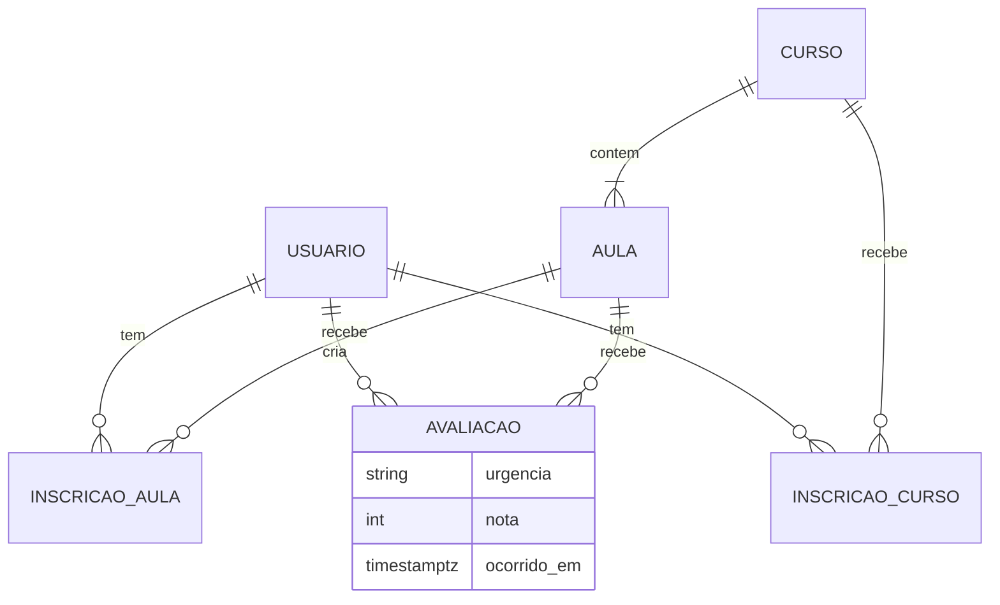
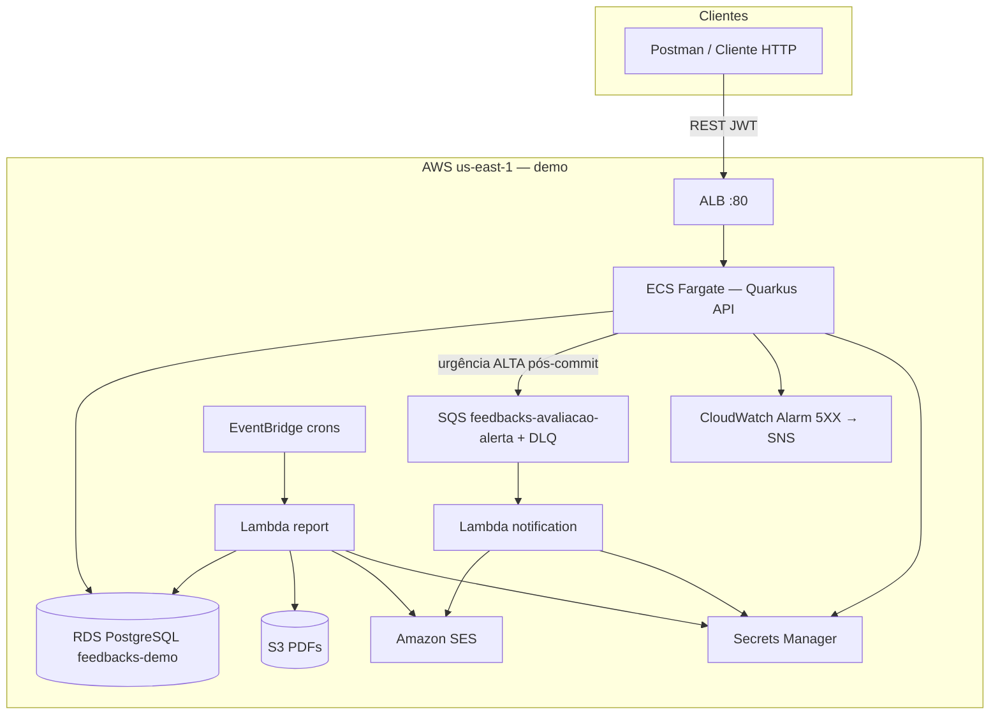
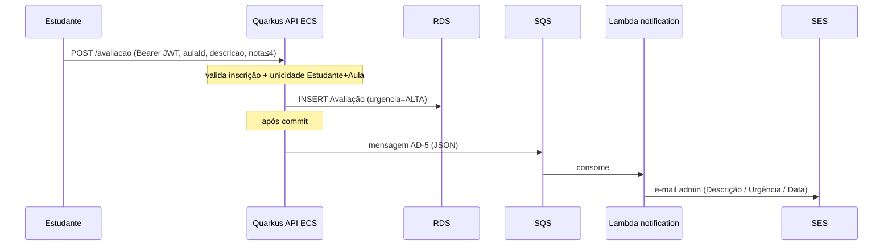

# Tech Challenge Fase 4 — Plataforma de Feedbacks (Cloud / Serverless)

---

## Capa e Identificação

| Campo | Informação |
|-------|------------|
| **Título** | Tech Challenge Fase 4 — Plataforma de Feedbacks FIAP |
| **Instituição** | FIAP — Pós-Graduação em Arquitetura e Desenvolvimento Java |
| **Disciplina / Fase** | Tech Challenge — Fase 4 (Cloud Computing, Serverless e Deploy) |
| **Aluno** | Thiago Henrique Alves Ferreira *(pacote base: `com.fiap.feedbacks`)* |
| **Turma** | 11ADJT |
| **Projeto** | Plataforma de captura e triagem de feedbacks de aulas (API + efeitos serverless na AWS) |
| **Versão do relatório** | 1.0 |
| **Data de consolidação** | 28 de julho de 2026 |
| **Repositório (código-fonte)** | [https://github.com/thiagohaf/adjt-fase4-feedback](https://github.com/thiagohaf/adjt-fase4-feedback) *(público)* |
| **Vídeo de apresentação (YouTube)** | [https://www.youtube.com/watch?v=s_fCGvxCaks](https://www.youtube.com/watch?v=s_fCGvxCaks) — roteiro em [`docs/ROTEIRO-DEMO.md`](./ROTEIRO-DEMO.md) (13 cenas) |
| **Documentos de referência** | [README.md](../README.md), [AUDITORIA-TECH-CHALLENGE-FASE4.md](./AUDITORIA-TECH-CHALLENGE-FASE4.md), [ARCHITECTURE-SPINE.md](../_bmad-output/planning-artifacts/architecture/architecture-adjt-fase4-2026-07-20/ARCHITECTURE-SPINE.md), enunciado [`ADJT - Fase 4 - Tech Challenge_rev.pdf`](./ADJT%20-%20Fase%204%20-%20Tech%20Challenge_rev.pdf) |

---

## 1. Introdução e Contextualização

### 1.1 Problema proposto pela banca

O **Tech Challenge da Fase 4** exige a construção de uma aplicação em **nuvem**, com ênfase em:

1. **Aplicação hospedada na cloud** — API de negócio disponível via internet, com componentes de suporte (banco, filas, armazenamento, e-mail).
2. **Funções serverless (mínimo 2, SRP)** — notificação automática de problemas críticos e geração de relatórios periódicos.
3. **Deploy automatizado e monitoramento** — esteiras que provisionam/atualizam componentes e observabilidade mínima (health + alarme).
4. **Segurança e governança de acesso** — autenticação/autorização, segredos fora do código e restrição de acesso a dados.
5. **Artefatos de entrega** — repositório público, documentação de arquitetura/deploy/funções e vídeo de demonstração.

O domínio é uma **plataforma de feedbacks de aulas**: estudantes avaliam aulas; administradores acompanham o panorama e recebem alertas de urgência alta e relatórios agregados.

### 1.2 Visão geral da solução adotada

A entrega é um **monólito modular Quarkus** na API, com **dois efeitos assíncronos serverless** na AWS:

| Unidade | Deploy | Responsabilidade principal |
|---------|--------|----------------------------|
| `feedbacks/apps/api` | ECS Fargate + ALB | Auth JWT, catálogo, inscrição, avaliação, health |
| `feedbacks/apps/notification` | AWS Lambda | Alerta SES para urgência **ALTA** (SRP) |
| `feedbacks/apps/report` | AWS Lambda | Relatórios diário/semanal → SES (HTML) + S3 (PDF) (SRP) |
| `feedbacks/infra` | AWS CDK v2 (Java) | 3 stacks: alerta, relatório, API |

Infraestrutura complementar na demo: **RDS PostgreSQL** (`feedbacks-demo`), **SQS + DLQ**, **EventBridge**, **SES**, **S3**, **Secrets Manager**, **CloudWatch Alarm → SNS**.

O fluxo feliz: o estudante autentica-se, inscreve-se em curso/aula e cria uma avaliação. A API deriva a urgência (`ALTA` / `MEDIA` / `BAIXA`). Se **ALTA** (nota ≤ 4), após o commit publica na fila SQS; a Lambda de notificação envia e-mail ao admin via SES. Relatórios diário/semanal são disparados por EventBridge (ou invoke manual) pela Lambda de relatório.

O desenvolvimento seguiu **SDD (Spec-Driven Development)**: **BMAD** (Brief / PRD / Architecture Spine) + **OpenSpec** (modules / changes / specs vivas).

---

## 2. Decisões Arquiteturais

### 2.1 Paradigma: Modular Monolith + Async Side Effects

Conforme **AD-1** e **AD-2** do Architecture Spine:

| Camada | Papel | Restrição |
|--------|-------|-----------|
| **api/web** | Resources JAX-RS, DTOs, filtros | Não contém regras de negócio |
| **application** | Use Cases e ports | Depende só de interfaces |
| **domain** | Entidades, urgência, unicidades | Sem Quarkus, JPA, AWS SDK |
| **infrastructure** | JPA, JWT, SQS/Kafka adapters | Única camada que conhece frameworks |

```
api/web → application → domain ← infrastructure
```

**Benefícios práticos:**

- Domínio testável sem I/O (ex.: `Urgencia`, unicidade de avaliação).
- Troca Kafka (local) ↔ SQS (AWS) via porta `EvaluationEventPublisher` (**AD-7**).
- Lambdas isoladas por SRP (**AD-3**, **AD-13**): notification sem JDBC; report read-only no domínio.

**Pacotes base:**

| Unidade | Pacote |
|---------|--------|
| API | `com.fiap.feedbacks.{api\|application\|domain\|infrastructure}` |
| Notification | `com.fiap.feedbacks.lambda.notification` |
| Report | `com.fiap.feedbacks.lambda.report` |

### 2.2 ADRs / Architecture Decisions consolidados

| AD | Decisão | Motivo |
|----|---------|--------|
| **AD-1** | API em ECS Fargate + ALB; efeitos em Lambdas; sem MSK em prod | Custo e encaixe no enunciado (cloud + serverless) |
| **AD-2** | Hexagonal / direção de dependência | Domínio isolado e testável |
| **AD-3** | API = única writer do domínio | Lambdas não mutam Avaliação |
| **AD-4** | Persistência + urgência na TX; publish ALTA após commit | Alerta nunca sem avaliação persistida |
| **AD-5** | Contrato JSON único do alerta | Paridade Kafka local ≡ SQS AWS |
| **AD-6** | Uma Lambda report, `periodo=diario\|semanal`, janelas civis SP | SRP + requisitos R6 / FR-11 / FR-17 |
| **AD-7** | Kafka só local; SQS na AWS | Evita MSK; adapters por ambiente |
| **AD-8** | JWT HS256 + papéis ESTUDANTE / ADMINISTRADOR | Segurança transversal |
| **AD-9** | Superfície HTTP `/api/v1/*` e `POST /avaliacao` | Alinhamento ao enunciado (ASCII) |
| **AD-10** | Invoke manual da Lambda report (sem endpoint admin) | Demo sem cron obrigatória |
| **AD-11** | Health + alarme 5XX → SNS | Monitoramento exigido |
| **AD-12** | Secrets Manager + CDK + teardown | Governança e custo de demo |
| **AD-13** | Lambdas Quarkus (`quarkus-amazon-lambda`) | Stack unificada (SCP Spring → Quarkus) |
| **AD-14** | JaCoCo line coverage ≥ 90% por módulo | Gate de qualidade |
| **AD-15** | Inscrição Curso+Aula antes de avaliar; 409 em duplicata | Invariantes de domínio |
| **AD-16** | Read model do relatório = tabela Avaliação da API | Schema único |
| **AD-17** | Envelope AWS (demo: VPC default + harden SG RDS) | Segurança vs. custo acadêmico |
| **AD-18** | Fault tolerance nas bordas + DLQ | Resiliência sem reverter Avaliação |

### 2.3 Modelo de dados (domínio)



**Regra de urgência (domínio):** nota ≤ 4 → `ALTA`; ≤ 7 → `MEDIA`; senão → `BAIXA`.

### 2.4 Diagrama de contexto (AWS)



**Nota de região:** o Architecture Spine cita `sa-east-1` como alvo; a demo acadêmica e as esteiras operam em **`us-east-1`** (créditos/conta), documentado no README e no roteiro de demo.

---

## 3. Capacidades de Negócio e Fluxos

### 3.1 Requisitos funcionais (PRD → entrega)

| FR | Capacidade | Evidência principal |
|----|------------|---------------------|
| FR-1 | Login e JWT | `AuthResource` / `LoginUseCase` |
| FR-2 | Autorização por papel | `@RolesAllowed` + claim `role` |
| FR-3 / FR-4 | Catálogo Curso/Aula | `CursoResource` / `AulaResource` |
| FR-5 / FR-6 | Inscrição Curso+Aula | Use cases de enrollment + gate na avaliação |
| FR-7 / FR-8 | Criar e listar avaliação | `POST /avaliacao`, listagens por papel |
| FR-9 | Urgência | `Urgencia` no domain |
| FR-10 | Alerta ALTA | SQS → Lambda notification → SES |
| FR-11 / FR-17 | Relatório semanal / diário | Lambda report + EventBridge |
| FR-12 | HTML + PDF | SES HTML + OpenPDF no S3 |
| FR-13 / FR-14 | Health + métricas | `/api/v1/health`, `/q/health`, alarme 5XX |
| FR-15 | Deploy automatizado | GitHub Actions `deploy(all)` + CDK |
| FR-16 | Roteiro de demonstração | `docs/ROTEIRO-DEMO.md` |

### 3.2 Fluxo de avaliação crítica (alerta)



### 3.3 Fluxo de relatório

| Aspecto | Valor |
|---------|-------|
| Função | `feedbacks-lambda-report` |
| Triggers | EventBridge diário/semanal **08:00 America/Sao_Paulo**; invoke manual (`periodo`) |
| Saídas | E-mail HTML (SES) + PDF tabular (S3: `relatorios/<periodo>/yyyy-MM-dd/<uuid>.pdf`) |
| Conteúdo | Média de notas; qty/dia; qty/urgência; lista Descrição / Urgência / Data de envio |

### 3.4 Contratos alinhados ao enunciado

| Esperado (PDF) | Implementado | Status |
|----------------|--------------|--------|
| `POST /avaliação` | `POST /avaliacao` (ASCII) | Atende |
| Body descrição + nota 0–10 | Body `{ aulaId, descricao, nota }` | Atende (com `aulaId` de domínio) |
| E-mail alerta: descrição, urgência, data | `ProcessAlertUseCase.buildBody` | Atende |
| Relatório: média + quantidades + lista | HTML/PDF da Lambda report | Atende |

---

## 4. Cloud, Serverless e IaC

### 4.1 Stacks CDK (Java)

| Stack | Recursos |
|-------|----------|
| `FeedbacksAlertaNotificationStack` | SQS + DLQ → Lambda notification → SES |
| `FeedbacksRelatorioStack` | EventBridge → Lambda report → S3 + SES |
| `FeedbacksApiStack` | ECR (evidência) + ECS Fargate + ALB + alarme 5XX → SNS; imagem via `DockerImageAsset` |

Extras de demo (script `demo-lifecycle.sh`, não só CDK): RDS `feedbacks-demo`, secrets `feedbacks/db`, `feedbacks/jwt`, `feedbacks/adminEmail`, `harden-rds-sg`.

### 4.2 Funções serverless (SRP)

| Função | Responsabilidade única | Trigger | Saída |
|--------|------------------------|---------|-------|
| `feedbacks-lambda-notification` | Alerta de urgência ALTA | SQS | SES (texto) |
| `feedbacks-lambda-report` | Relatório diário/semanal | EventBridge (+ invoke) | SES (HTML) + S3 (PDF) |

Validação estrutural: `ModuleConstraintsTest` em ambos os módulos Lambda (notification sem JDBC/REST; report sem Flyway/REST de negócio).

### 4.3 Segurança e governança (R1)

| Controle | Implementação |
|----------|---------------|
| AuthN/AuthZ | JWT HS256; papéis `ESTUDANTE` / `ADMINISTRADOR` |
| Segredos | Secrets Manager (`jwtSecret`, DB, `adminEmail`) — fora do repo/imagem |
| Rede / dados | Após `harden-rds-sg`: RDS sem `0.0.0.0/0`; só ECS SG + Report Lambda SG |
| HTTPS | Opcional no ALB via `FEEDBACKS_ACM_CERT_ARN` |
| Ownership | Estudante lista só as próprias avaliações; admin lista todas |

### 4.4 Observabilidade (R4)

- Health: `GET /api/v1/health` e probes `/q/health` / `/q/health/ready`
- CloudWatch: métricas ALB (RequestCount, 5XX, TargetResponseTime)
- Alarme: `feedbacks-api-target-5xx` com ação **SNS** → e-mail admin

### 4.5 Ciclo de vida da demo (custo)

| Workflow | Função |
|----------|--------|
| `deploy(all)` | Sobe/retoma: RDS, secrets, Lambdas, 3 stacks, crons, seed, smoke, harden SG |
| `pause(demo)` | Corta custo horário (crons off, destroy API/ALB, stop RDS) |
| `destroy(all)` | Teardown (confirmação `destroy`) |

Script local equivalente: `feedbacks/infra/scripts/demo-lifecycle.sh`.

---

## 5. Segurança Transversal

### 5.1 JWT e matriz de papéis

| Papel | Capacidades |
|-------|-------------|
| **ADMINISTRADOR** | Cria Curso/Aula; lista todas as avaliações; lê catálogo |
| **ESTUDANTE** | Lê catálogo; inscreve; avalia; lista só as próprias avaliações |

Login e health são públicos; demais rotas exigem `Authorization: Bearer`.

### 5.2 Identidade do estudante

O estudante autenticado é obtido do JWT (`sub` / identity Quarkus); a criação de avaliação não aceita impersonação via body — o vínculo Estudante+Aula é do token + inscrição persistida.

### 5.3 Usuários demo (seed Flyway)

| Papel | E-mail | Senha |
|-------|--------|-------|
| ESTUDANTE | `estudante@demo.fiap` | `senha123` |
| ADMINISTRADOR | `admin@demo.fiap` | `admin123` |

---

## 6. Garantia de Qualidade (QA)

### 6.1 Cobertura JaCoCo (gate ≥ 90% linha — AD-14)

O `jacoco-maven-plugin` (0.8.13) está configurado nos três módulos com `check` na fase `verify` (`LINE` COVEREDRATIO ≥ 0.90).

**Resultado dos relatórios locais (`target/jacoco-report`, consolidação 28/07/2026):**

| Módulo | Instructions | Branches | Lines | Gate ≥ 90% (LINE) |
|--------|-------------|----------|-------|-------------------|
| `feedbacks-api` | **98,21%** (3179/3237) | **91,84%** (180/196) | **97,25%** (848/872) | ✅ |
| `feedbacks-notification` | **95,93%** (424/442) | **100%** (42/42) | **95,28%** (101/106) | ✅ |
| `feedbacks-report` | **97,81%** (1206/1233) | **98,86%** (87/88) | **97,59%** (243/249) | ✅ |

Relatórios HTML: `feedbacks/apps/{api\|notification\|report}/target/jacoco-report/index.html`

### 6.2 Estratégia de testes

O projeto emprega **52 classes de teste** (`*Test*.java`: 38 API + 6 notification + 8 report), na pirâmide:

| Nível | Exemplos | Objetivo |
|-------|----------|----------|
| Unitário de domínio | `Urgencia`, entidades, exceções de negócio | Regras sem Quarkus |
| Use cases (ports mockados) | Login, criar avaliação, alerta, relatório | Orquestração e gates |
| `@QuarkusTest` / integração | Resources HTTP, Dev Services PostgreSQL | Contrato REST + persistência |
| Constraints estruturais | `ModuleConstraintsTest` nas Lambdas | SRP / sem dependências proibidas |

CI: workflow **`test(api)`** em push/PR na branch `develop` (paths `feedbacks/apps/api/**`) + disparo manual; gate JaCoCo e artefato HTML.

### 6.3 Resultado da auditoria final

Conforme [AUDITORIA-TECH-CHALLENGE-FASE4.md](./AUDITORIA-TECH-CHALLENGE-FASE4.md) (28/07/2026):

| Categoria | Resultado |
|-----------|-----------|
| Requisitos R1–R6 | **6/6 ATENDE** |
| Regras (serverless, cloud, SRP×2) | **ATENDE** |
| Contratos (avaliação, alerta, relatório) | **ATENDE** (residual: `aulaId` no body) |
| Repo público | **ATENDE** |
| Vídeo YouTube | **ATENDE** — [https://www.youtube.com/watch?v=s_fCGvxCaks](https://www.youtube.com/watch?v=s_fCGvxCaks) |
| Veredito | **Apto à entrega acadêmica** (software + nuvem + docs + vídeo) |

### 6.4 Artefatos de validação manual

| Artefato | Localização |
|----------|-------------|
| Repositório GitHub | [https://github.com/thiagohaf/adjt-fase4-feedback](https://github.com/thiagohaf/adjt-fase4-feedback) |
| Vídeo de apresentação | [https://www.youtube.com/watch?v=s_fCGvxCaks](https://www.youtube.com/watch?v=s_fCGvxCaks) |
| Collection Postman | `docs/postman/feedbacks-api.postman_collection.json` |
| Environments | `feedbacks-api.local` / `feedbacks-api.aws-alb` |
| Roteiro de vídeo | `docs/ROTEIRO-DEMO.md` |
| UJ-4 (relatórios) | `feedbacks/apps/report/UJ4-ROTEIRO.md` |
| Infra CDK | `feedbacks/infra/README.md` |

---

## 7. Método de Trabalho (BMAD + OpenSpec / SDD)

A entrega não começou pelo código: primeiro o **quê** e o **porquê** (BMAD), depois o **como** em specs versionadas (OpenSpec), e só então a implementação.

| Camada | Pasta | Papel |
|--------|-------|-------|
| Product Brief / PRD | `_bmad-output/planning-artifacts/` | Problema, FRs, NFRs, jornadas |
| Architecture Spine | `_bmad-output/.../ARCHITECTURE-SPINE.md` | ADs vinculantes |
| Sprint Change Proposals | `_bmad-output/planning-artifacts/` | Ex.: re-baseline Spring → Quarkus |
| Módulos OpenSpec | `openspec/modules/01`…`06` | Auth, catálogo, inscrição, avaliação, alerta, relatórios |
| Specs vivas | `openspec/specs/` | Fonte canônica pós-archive |
| Changes | `openspec/changes/` (+ archive) | propose → design → specs → tasks → apply |

Isso materializa rastreabilidade FR ↔ AD ↔ código ↔ teste, adequada a uma entrega acadêmica com rubrica de qualidade e documentação.

---

## 8. Conclusão

A arquitetura entregue no Tech Challenge Fase 4 materializa os requisitos da banca em uma solução **cloud-native, serverless e documentada**:

- **Monólito modular Quarkus** em ECS Fargate concentra o domínio síncrono com hexagonal e JWT.
- **Duas Lambdas SRP** cobrem alerta de urgência ALTA (SQS → SES) e relatórios diário/semanal (EventBridge → SES + S3).
- **CDK Java + GitHub Actions** automatizam deploy, pause de custo e destroy — alinhados a créditos limitados de demo.
- **Secrets Manager, harden de SG do RDS e alarme 5XX → SNS** atendem segurança e monitoramento.
- **JaCoCo ≥ 90%** nos três módulos (cobertura real > 95% em lines) sustenta a qualidade.
- **BMAD + OpenSpec** registram decisões e specs como fonte de verdade.

A auditoria classificou o repositório como **apto à entrega acadêmica**. O vídeo de demonstração está publicado em [https://www.youtube.com/watch?v=s_fCGvxCaks](https://www.youtube.com/watch?v=s_fCGvxCaks), alinhado ao roteiro de 13 cenas e ao ciclo `deploy` / `pause` / `destroy`.

Para evolução pós-fase: VPC privada completa (AD-17 alvo), HTTPS obrigatório via ACM, e eventual desacoplamento de read models — sem invalidar a conformidade da entrega atual.

---

## Referências

| Recurso | Conteúdo |
|---------|----------|
| [Repositório GitHub — adjt-fase4-feedback](https://github.com/thiagohaf/adjt-fase4-feedback) | Código-fonte, apps Quarkus, CDK e documentação |
| [Vídeo de apresentação (YouTube)](https://www.youtube.com/watch?v=s_fCGvxCaks) | Demonstração da solução, cloud, serverless e fluxos principais |
| [README.md](../README.md) | Arquitetura, execução local, Postman, AWS, CI/CD |
| [AUDITORIA-TECH-CHALLENGE-FASE4.md](./AUDITORIA-TECH-CHALLENGE-FASE4.md) | Matriz de conformidade vs. enunciado |
| [ROTEIRO-DEMO.md](./ROTEIRO-DEMO.md) | Roteiro YouTube (FR-16) |
| [ARCHITECTURE-SPINE.md](../_bmad-output/planning-artifacts/architecture/architecture-adjt-fase4-2026-07-20/ARCHITECTURE-SPINE.md) | ADs e paradigma |
| [PRD](../_bmad-output/planning-artifacts/prds/prd-adjt-fase4-2026-07-20/prd.md) | Requisitos funcionais |
| [feedbacks/infra/README.md](../feedbacks/infra/README.md) | Stacks CDK, secrets, invoke |
| [ADJT - Fase 4 - Tech Challenge_rev.pdf](./ADJT%20-%20Fase%204%20-%20Tech%20Challenge_rev.pdf) | Enunciado oficial |
| [Postman collection](./postman/feedbacks-api.postman_collection.json) | Fluxos de validação |

---

*Relatório técnico de entrega — Tech Challenge FIAP Fase 4. Documento baseado em README, Architecture Spine, auditoria final, OpenSpec/BMAD e relatórios JaCoCo (consolidação: 28/07/2026).*
