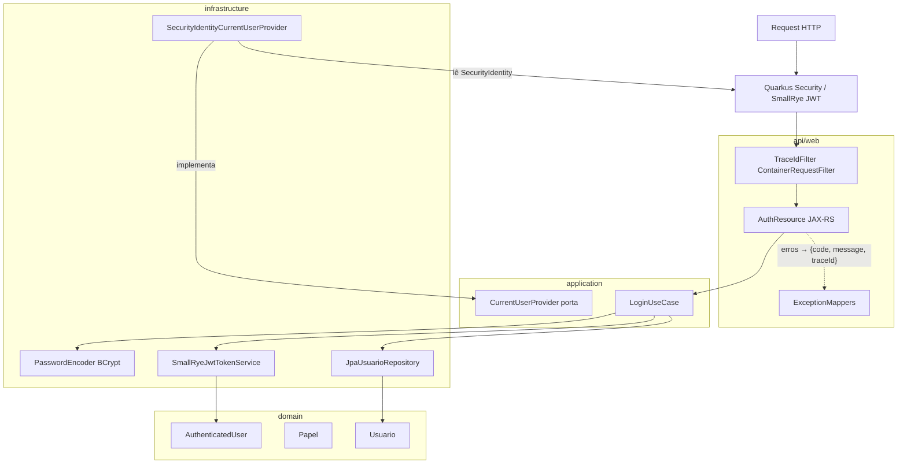

# Design — Módulo 01: Autenticação e Papéis

| Campo | Valor |
| --- | --- |
| **Módulo** | `01-autenticacao-e-papeis` |
| **Stack** | Java 17, Quarkus 3.33 LTS, Quarkus Security + SmallRye JWT, JWT HS256 (`mp.jwt.verify.publickey.algorithm=HS256`; secret em Secrets Manager, chave `jwtSecret`) |
| **Paradigma** | Hexagonal (ports & adapters) dentro do modular monolith |
| **Status** | Rascunho para revisão |

---

## 1. Visão arquitetural

O módulo de autenticação atravessa as camadas do monólito conforme AD-2:



**Fluxo de login:**

1. `AuthResource` recebe `LoginRequest`, delega a `LoginUseCase`.
2. `LoginUseCase` busca `Usuario` por email via `UsuarioRepository` (porta).
3. Valida senha com `PasswordEncoder.matches`.
4. Emite JWT via `TokenService.generate(AuthenticatedUser)` (adapter `smallrye-jwt-build`).
5. Retorna `LoginResponse` com `accessToken`, `tokenType`, `expiresIn`.

**Fluxo de request autenticado:**

1. A extensão `quarkus-smallrye-jwt` extrai o Bearer token do header e valida assinatura (HS256) e expiração automaticamente.
2. Quarkus Security popula o `SecurityIdentity` com principal (`sub`) e roles derivadas da claim `role`.
3. `@RolesAllowed` nos resources JAX-RS enforce a matriz de autorização.
4. Controller/use case downstream consulta `CurrentUserProvider` (implementado por `SecurityIdentityCurrentUserProvider` sobre o `SecurityIdentity`/`JsonWebToken`) quando precisa do usuário logado.

---

## 2. Estrutura de pacotes

```text
com.fiap.feedbacks
├── api
│   └── web
│       ├── auth
│       │   ├── AuthResource.java     # JAX-RS @Path("/api/v1/auth")
│       │   └── dto
│       │       ├── LoginRequest.java
│       │       └── LoginResponse.java
│       └── error
│           ├── ApiErrorResponse.java
│           ├── DomainExceptionMapper.java      # ExceptionMapper's → {code, message, traceId}
│           ├── AuthExceptionMappers.java       # 401/403 (JWT ausente/inválido/expirado, forbidden)
│           ├── ValidationExceptionMapper.java  # 400 VALIDATION_ERROR
│           └── TraceIdFilter.java              # ContainerRequestFilter → traceId no MDC
├── application
│   ├── auth
│   │   ├── LoginUseCase.java
│   │   ├── port
│   │   │   ├── TokenService.java
│   │   │   ├── UsuarioRepository.java
│   │   │   └── CurrentUserProvider.java
│   │   └── dto
│   │       └── AuthenticatedUser.java
├── domain
│   ├── auth
│   │   ├── Usuario.java          # entidade de domínio (id, email, senhaHash, papel)
│   │   └── Papel.java            # enum ESTUDANTE | ADMINISTRADOR
│   └── exception
│       ├── InvalidCredentialsException.java
│       ├── InvalidTokenException.java
│       ├── TokenExpiredException.java
│       └── ForbiddenAccessException.java
└── infrastructure
    ├── persistence
    │   ├── UsuarioEntity.java
    │   ├── UsuarioJpaRepository.java
    │   └── JpaUsuarioRepository.java   # adapter
    └── security
        ├── SmallRyeJwtTokenService.java            # adapter TokenService (smallrye-jwt-build)
        ├── JwtProperties.java                      # @ConfigMapping
        └── SecurityIdentityCurrentUserProvider.java # adapter CurrentUserProvider (SecurityIdentity)
```

---

## 3. Portas (interfaces)

### 3.1 `TokenService` (application port)

```java
public interface TokenService {

    String generate(AuthenticatedUser user);

    AuthenticatedUser parse(String token);
}
```

**Responsabilidades:**

- `generate`: cria JWT HS256 com claims `sub` (UUID), `role`, `iat`, `exp`.
- `parse`: valida assinatura e expiração; lança exceções de domínio em falha.

### 3.2 `UsuarioRepository` (application port)

```java
public interface UsuarioRepository {

    Optional<Usuario> findByEmail(String email);
}
```

### 3.3 `CurrentUserProvider` (application port)

```java
public interface CurrentUserProvider {

    AuthenticatedUser getCurrentUser();

    UUID getCurrentUserId();

    Papel getCurrentRole();

    boolean hasRole(Papel papel);
}
```

Usado por casos de uso downstream (ex.: filtrar Avaliações do Estudante logado).

### 3.4 `LoginUseCase`

```java
public class LoginUseCase {

    public LoginResult execute(LoginCommand command) {
        // 1. findByEmail
        // 2. passwordEncoder.matches
        // 3. tokenService.generate
        // throws InvalidCredentialsException
    }
}
```

---

## 4. DTOs

### 4.1 Request/Response HTTP (api/web)

#### `LoginRequest`

| Campo | Tipo | Validação |
| --- | --- | --- |
| `email` | `String` | `@NotBlank`, `@Email` |
| `password` | `String` | `@NotBlank`, `@Size(min=6)` |

```java
public record LoginRequest(
    @NotBlank @Email String email,
    @NotBlank @Size(min = 6) String password
) {}
```

#### `LoginResponse`

| Campo | Tipo | Descrição |
| --- | --- | --- |
| `accessToken` | `String` | JWT compacto |
| `tokenType` | `String` | Sempre `"Bearer"` |
| `expiresIn` | `long` | TTL em segundos |

```java
public record LoginResponse(
    String accessToken,
    String tokenType,
    long expiresIn
) {}
```

#### `ApiErrorResponse`

| Campo | Tipo | Descrição |
| --- | --- | --- |
| `code` | `String` | Código estável (ex.: `AUTH_INVALID_CREDENTIALS`) |
| `message` | `String` | Mensagem legível |
| `traceId` | `String` | Correlaciona com logs (MDC) |

```java
public record ApiErrorResponse(
    String code,
    String message,
    String traceId
) {}
```

### 4.2 Objetos de aplicação

#### `AuthenticatedUser`

```java
public record AuthenticatedUser(
    UUID id,
    String email,
    Papel papel
) {}
```

#### `LoginCommand` / `LoginResult`

```java
public record LoginCommand(String email, String password) {}

public record LoginResult(String accessToken, long expiresInSeconds) {}
```

---

## 5. Modelo de domínio

### 5.1 `Papel` (enum)

```java
public enum Papel {
    ESTUDANTE,
    ADMINISTRADOR
}
```

Serialização JWT: string exata (`ESTUDANTE`, `ADMINISTRADOR`).

### 5.2 `Usuario` (domain entity)

| Atributo | Tipo | Regra |
| --- | --- | --- |
| `id` | `UUID` | Gerado na persistência |
| `email` | `String` | Único, lowercase normalizado |
| `senhaHash` | `String` | BCrypt; nunca exposto na API |
| `papel` | `Papel` | ESTUDANTE ou ADMINISTRADOR |

Método de domínio opcional:

```java
public boolean senhaCorresponde(String raw, PasswordEncoder encoder) {
    return encoder.matches(raw, senhaHash);
}
```

> **Nota:** `PasswordEncoder` é porta/infra; o use case pode orquestrar a verificação para manter o domain puro. Implementação BCrypt: `BcryptUtil` de `quarkus-elytron-security-common` (ou biblioteca bcrypt standalone equivalente) — ver §12.

### 5.3 Persistência — `UsuarioEntity` + Flyway

**Tabela `usuario`:**

```sql
CREATE TABLE usuario (
    id          UUID PRIMARY KEY,
    email       VARCHAR(255) NOT NULL UNIQUE,
    senha_hash  VARCHAR(255) NOT NULL,
    papel       VARCHAR(20)  NOT NULL CHECK (papel IN ('ESTUDANTE', 'ADMINISTRADOR')),
    criado_em   TIMESTAMPTZ  NOT NULL DEFAULT NOW()
);
```

**Seed demo (`V2__seed_usuarios.sql`):**

| email | senha (plaintext só na doc) | papel |
| --- | --- | --- |
| `estudante@demo.fiap` | `senha123` | ESTUDANTE |
| `admin@demo.fiap` | `admin123` | ADMINISTRADOR |

Hash BCrypt gerado no migration (não plaintext no SQL).

---

## 6. JWT — contrato técnico

| Aspecto | Decisão |
| --- | --- |
| Algoritmo | HS256 |
| Segredo | `jwtSecret` (env local / Secrets Manager AWS) |
| Header | `Authorization: Bearer <token>` |
| Claims | `sub` (UUID string), `role` (string), `iat`, `exp` |
| TTL | Configurável; default **86400s (24h)** para demo |
| Biblioteca | `smallrye-jwt-build` (emissão) + `quarkus-smallrye-jwt` (validação), com `mp.jwt.verify.publickey.algorithm=HS256` explícito |

**Exemplo payload decodificado:**

```json
{
  "sub": "a1b2c3d4-e5f6-7890-abcd-ef1234567890",
  "role": "ESTUDANTE",
  "iat": 1753000000,
  "exp": 1753086400
}
```

---

## 7. Segurança — Quarkus Security + SmallRye JWT (configuração proposta)

### 7.1 Validação de token (extensão `quarkus-smallrye-jwt`)

```properties
# application.properties
quarkus.http.auth.proactive=false             # 401 tratáveis por ExceptionMapper (ver §8.3)
mp.jwt.verify.publickey.algorithm=HS256       # AD-8: HS256 explícito (SmallRye privilegia RSA)
smallrye.jwt.verify.secretkey=${JWT_SECRET_JWK}  # JWK simétrico base64url derivado de jwtSecret (ver nota)
smallrye.jwt.path.groups=role                 # claim `role` → roles do SecurityIdentity
```

> SmallRye JWT privilegia RSA por padrão — manter HS256 exige a config explícita acima (decisão AD-8; não toca AD-12 nem as chaves de secrets).
>
> **Nota (chave simétrica):** o SmallRye só aceita chave simétrica em formato **JWK** (`{"kty":"oct","k":"<base64url(secret)>"}`), inline via `smallrye.jwt.verify.secretkey` (valor = JWK base64url-encoded) ou arquivo via `smallrye.jwt.verify.key.location`. O valor cru `jwtSecret` do Secrets Manager permanece a **única fonte de verdade**; o wrapping em JWK é detalhe de bootstrap da implementação (Passo 4). Se a implementação optar por `smallrye.jwt.verify.key.location`, o equivalente SmallRye do algoritmo é `smallrye.jwt.verify.algorithm=HS256`.
>
> Sem verificação de `iss`: o contrato de claims (§6) é exatamente `sub`, `role`, `iat`, `exp` — não introduzir `mp.jwt.verify.issuer`.

### 7.2 Rotas públicas vs protegidas (`@RolesAllowed` nos resources JAX-RS)

```java
@Path("/api/v1/auth/login")  // @PermitAll — público
// health público: SmallRye Health (/q/health), exposto em path compatível com o contrato
// /api/v1/health e o ALB health check (AD-9/AD-11) — detalhe no módulo observabilidade

@POST @Path("/api/v1/cursos")                  @RolesAllowed("ADMINISTRADOR")
@POST criação de Aula (qualquer rota de aula)  @RolesAllowed("ADMINISTRADOR")
@POST @Path("/api/v1/avaliacoes")              @RolesAllowed("ESTUDANTE")
@POST inscrição em Curso OU Aula (todas as rotas de inscrição) @RolesAllowed("ESTUDANTE")
@GET  @Path("/api/v1/avaliacoes")              @RolesAllowed({"ESTUDANTE", "ADMINISTRADOR"})
// demais rotas de negócio: @Authenticated (ou @RolesAllowed equivalente)
```

> Toda rota de escrita nova (aulas, inscrições — inclusive em nível de Aula) **deve** nascer com o `@RolesAllowed` da matriz §3.3 do proposal; o fallback `@Authenticated` não substitui a autorização por papel.

> Regras finas (Estudante vê só próprias Avaliações) ficam no **caso de uso/query**, não só na anotação — conforme AD-8.

### 7.3 Roles

A claim `role` do JWT (`ESTUDANTE` | `ADMINISTRADOR`) é mapeada diretamente para as roles do `SecurityIdentity` via `smallrye.jwt.path.groups=role` — sem prefixo `ROLE_`; `@RolesAllowed` usa o nome exato do enum `Papel`.

### 7.4 Fluxo de request autenticado

1. A extensão extrai o token do header `Authorization: Bearer`.
2. Ausente em rota protegida → 401 (mapeado para `AUTH_MISSING_TOKEN` via `ExceptionMapper`).
3. Presente → validação automática de assinatura HS256 e `exp`; `SecurityIdentity` populado.
4. Token inválido/expirado → 401 (`AUTH_INVALID_TOKEN` / `AUTH_TOKEN_EXPIRED`); papel insuficiente → 403 (`AUTH_FORBIDDEN`).

---

## 8. Tratamento de exceções

### 8.1 Hierarquia

```text
RuntimeException
└── DomainException (abstract, opcional)
    ├── InvalidCredentialsException   → 401 AUTH_INVALID_CREDENTIALS
    ├── InvalidTokenException         → 401 AUTH_INVALID_TOKEN
    ├── TokenExpiredException         → 401 AUTH_TOKEN_EXPIRED
    └── ForbiddenAccessException      → 403 AUTH_FORBIDDEN

Quarkus Security (io.quarkus.security)
├── AuthenticationFailedException     → 401 AUTH_INVALID_TOKEN / AUTH_TOKEN_EXPIRED
├── UnauthorizedException             → 401 AUTH_MISSING_TOKEN
└── ForbiddenException                → 403 AUTH_FORBIDDEN (negação de @RolesAllowed)

Validation (Hibernate Validator)
└── ConstraintViolationException      → 400 VALIDATION_ERROR
```

### 8.2 `ExceptionMapper`s (JAX-RS)

```java
@Provider
public class InvalidCredentialsExceptionMapper
        implements ExceptionMapper<InvalidCredentialsException> {

    @Override
    public Response toResponse(InvalidCredentialsException e) {
        return Response.status(UNAUTHORIZED)
            .entity(error("AUTH_INVALID_CREDENTIALS", ...))
            .build();
    }
}

// Mesmo padrão para:
// InvalidTokenException / TokenExpiredException → 401
// ForbiddenAccessException / ForbiddenException → 403 AUTH_FORBIDDEN
// ConstraintViolationException → 400 VALIDATION_ERROR
```

### 8.3 Token ausente / falha de autenticação (401 da extensão)

**Pré-requisito:** `quarkus.http.auth.proactive=false` (§7.1) — com autenticação proativa (default do Quarkus), a falha de auth ocorre antes do roteamento JAX-RS e os `ExceptionMapper`s abaixo nunca disparam; desativá-la é obrigatório para preservar o envelope `{code, message, traceId}` nos 401.

```java
// ExceptionMapper<UnauthorizedException> → 401 AUTH_MISSING_TOKEN
//   (rota protegida sem Bearer token)
// ExceptionMapper<AuthenticationFailedException> → 401 AUTH_INVALID_TOKEN | AUTH_TOKEN_EXPIRED
//   distinção de expiração: inspecionar a causa raiz da validação
//   (ParseException/InvalidJwtException do SmallRye com indicação de `exp` → AUTH_TOKEN_EXPIRED;
//    qualquer outra falha de assinatura/formato → AUTH_INVALID_TOKEN) — SPEC-1.9 vs SPEC-1.10
```

### 8.4 `traceId`

- Gerado por `ContainerRequestFilter` (`TraceIdFilter`) ou obtido de header `X-Trace-Id` se presente.
- Armazenado em MDC; incluído em todo `ApiErrorResponse` e logs.

---

## 9. Configuração

### 9.1 `JwtProperties`

```java
@ConfigMapping(prefix = "app.jwt")
public interface JwtProperties {

    String secret();

    Duration expiration();
}
```

### 9.2 `application.properties` (profiles `%local` / `%aws`)

```properties
# validação SmallRye JWT (HS256 explícito — ver §7.1)
quarkus.http.auth.proactive=false
mp.jwt.verify.publickey.algorithm=HS256
smallrye.jwt.path.groups=role

# emissão / TTL
app.jwt.expiration=24h

# %local
%local.app.jwt.secret=${JWT_SECRET:dev-only-secret-min-256-bits-for-hs256-demo}

# %aws — injetado de Secrets Manager (chave jwtSecret) via CDK/ECS
%aws.app.jwt.secret=${JWT_SECRET}
```

> **Invariante — fonte única de secret:** emissão (`app.jwt.secret`) e validação (chave JWK de `smallrye.jwt.verify.secretkey`, §7.1) **devem** resolver para o mesmo valor de `jwtSecret` em todos os profiles — inclusive no default de dev do `%local`. O bootstrap da implementação deriva a representação JWK a partir de `app.jwt.secret` (não são dois secrets independentes).

---

## 10. Endpoint

| Método | Path | Auth | Descrição |
| --- | --- | --- | --- |
| `POST` | `/api/v1/auth/login` | Público | Emite JWT |

**Request:**

```json
{
  "email": "estudante@demo.fiap",
  "password": "senha123"
}
```

**Response 200:**

```json
{
  "accessToken": "eyJhbGciOiJIUzI1NiIs...",
  "tokenType": "Bearer",
  "expiresIn": 86400
}
```

---

## 11. Testes (AD-14)

| Classe | Tipo | Cenários |
| --- | --- | --- |
| `LoginUseCaseTest` | Unit (JUnit 5 + Mockito) | credenciais OK, email inexistente, senha errada |
| `SmallRyeJwtTokenServiceTest` | Unit | generate/parse round-trip, token expirado, assinatura inválida |
| `AuthSecurityTest` | `@QuarkusTest` + RestAssured | login público, rota protegida 401, 403 por papel |
| `AuthResourceTest` | `@QuarkusTest` + RestAssured | validação 400, resposta 200 shape |

**Meta:** line coverage ≥ 90% no código de produção deste módulo.

---

## 12. Dependências Maven (referência)

```xml
<dependencyManagement>
    <dependencies>
        <dependency>
            <groupId>io.quarkus.platform</groupId>
            <artifactId>quarkus-bom</artifactId>
            <version>${quarkus.platform.version}</version> <!-- fixar a release 3.33 LTS mais recente -->
            <type>pom</type>
            <scope>import</scope>
        </dependency>
    </dependencies>
</dependencyManagement>

<dependencies>
    <dependency><groupId>io.quarkus</groupId><artifactId>quarkus-rest-jackson</artifactId></dependency>
    <dependency><groupId>io.quarkus</groupId><artifactId>quarkus-hibernate-orm</artifactId></dependency>
    <dependency><groupId>io.quarkus</groupId><artifactId>quarkus-jdbc-postgresql</artifactId></dependency>
    <dependency><groupId>io.quarkus</groupId><artifactId>quarkus-flyway</artifactId></dependency>
    <dependency><groupId>io.quarkus</groupId><artifactId>quarkus-smallrye-jwt</artifactId></dependency>
    <dependency><groupId>io.quarkus</groupId><artifactId>quarkus-smallrye-jwt-build</artifactId></dependency>
    <dependency><groupId>io.quarkus</groupId><artifactId>quarkus-hibernate-validator</artifactId></dependency>
    <dependency><groupId>io.quarkus</groupId><artifactId>quarkus-smallrye-health</artifactId></dependency>
    <!-- BCrypt (adapter PasswordEncoder): BcryptUtil -->
    <dependency><groupId>io.quarkus</groupId><artifactId>quarkus-elytron-security-common</artifactId></dependency>

    <!-- testes -->
    <dependency><groupId>io.quarkus</groupId><artifactId>quarkus-junit5</artifactId><scope>test</scope></dependency>
    <dependency><groupId>io.rest-assured</groupId><artifactId>rest-assured</artifactId><scope>test</scope></dependency>
    <dependency><groupId>io.quarkus</groupId><artifactId>quarkus-jacoco</artifactId><scope>test</scope></dependency>
</dependencies>
```

Emissão e validação de JWT ficam nas extensões SmallRye (`quarkus-smallrye-jwt-build` / `quarkus-smallrye-jwt`) — sem biblioteca JWT adicional; contrato externo (claims, HS256) permanece.

---

## 13. Decisões em aberto (para revisão)

| # | Questão | Proposta default |
| --- | --- | --- |
| 1 | Biblioteca JWT | **Resolvida** (re-baseline Quarkus 2026-07-21): `smallrye-jwt-build` (emissão) + `quarkus-smallrye-jwt` (validação) |
| 2 | Path login: `/api/v1/auth/login` vs `/api/v1/login` | `/api/v1/auth/login` (agrupa auth) |
| 3 | Claim adicional `email` no JWT? | Não no MVP; `sub` + lookup se necessário |
| 4 | Múltiplos Estudantes no seed? | Um Estudante + um Admin suficientes para demo |
| 5 | Normalização de email (lowercase trim)? | Sim, no `LoginUseCase` antes do lookup |

---

## 14. Fora deste design (referência cruzada)

- **Health check** (FR-13): módulo observabilidade; SmallRye Health (`/q/health`) permanece rota pública (fora de `@RolesAllowed`).
- **Filtro de Avaliações por Estudante** (SPEC-2.11): implementado no módulo Avaliação usando `CurrentUserProvider`.
- **Lambdas**: não consomem JWT de usuário; credenciais IAM próprias.
