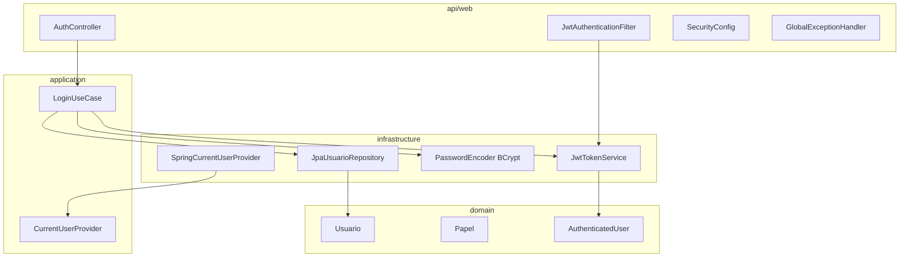

# Design — Módulo 01: Autenticação e Papéis

| Campo | Valor |
| --- | --- |
| **Módulo** | `01-autenticacao-e-papeis` |
| **Stack** | Java 17, Spring Boot 4.0.7, Spring Security, JWT HS256 |
| **Paradigma** | Hexagonal (ports & adapters) dentro do modular monolith |
| **Status** | Rascunho para revisão |

---

## 1. Visão arquitetural

O módulo de autenticação atravessa as camadas do monólito conforme AD-2:



**Fluxo de login:**

1. `AuthController` recebe `LoginRequest`, delega a `LoginUseCase`.
2. `LoginUseCase` busca `Usuario` por email via `UsuarioRepository` (porta).
3. Valida senha com `PasswordEncoder.matches`.
4. Emite JWT via `TokenService.generate(AuthenticatedUser)`.
5. Retorna `LoginResponse` com `accessToken`, `tokenType`, `expiresIn`.

**Fluxo de request autenticado:**

1. `JwtAuthenticationFilter` extrai Bearer token do header.
2. `TokenService.parse(token)` valida assinatura e expiração; retorna `AuthenticatedUser`.
3. Popula `SecurityContext` com `UsernamePasswordAuthenticationToken` e authorities derivadas de `Papel`.
4. Controller/use case downstream consulta `CurrentUserProvider` quando precisa do usuário logado.

---

## 2. Estrutura de pacotes

```text
com.fiap.feedbacks
├── api
│   ├── web
│   │   ├── auth
│   │   │   ├── AuthController.java
│   │   │   ├── dto
│   │   │   │   ├── LoginRequest.java
│   │   │   │   └── LoginResponse.java
│   │   │   └── SecurityConfig.java
│   │   └── error
│   │       ├── ApiErrorResponse.java
│   │       └── GlobalExceptionHandler.java
│   └── (JwtAuthenticationFilter em infrastructure/security ou api/config)
├── application
│   ├── auth
│   │   ├── LoginUseCase.java
│   │   ├── port
│   │   │   ├── TokenService.java
│   │   │   ├── UsuarioRepository.java
│   │   │   └── CurrentUserProvider.java
│   │   └── dto
│   │       └── AuthenticatedUser.java
├── domain
│   ├── auth
│   │   ├── Usuario.java          # entidade de domínio (id, email, senhaHash, papel)
│   │   └── Papel.java            # enum ESTUDANTE | ADMINISTRADOR
│   └── exception
│       ├── InvalidCredentialsException.java
│       ├── InvalidTokenException.java
│       ├── TokenExpiredException.java
│       └── ForbiddenAccessException.java
└── infrastructure
    ├── persistence
    │   ├── UsuarioEntity.java
    │   ├── UsuarioJpaRepository.java
    │   └── JpaUsuarioRepository.java   # adapter
    └── security
        ├── JwtTokenService.java        # adapter TokenService
        ├── JwtProperties.java
        ├── JwtAuthenticationFilter.java
        └── SpringCurrentUserProvider.java
```

---

## 3. Portas (interfaces)

### 3.1 `TokenService` (application port)

```java
public interface TokenService {

    String generate(AuthenticatedUser user);

    AuthenticatedUser parse(String token);
}
```

**Responsabilidades:**

- `generate`: cria JWT HS256 com claims `sub` (UUID), `role`, `iat`, `exp`.
- `parse`: valida assinatura e expiração; lança exceções de domínio em falha.

### 3.2 `UsuarioRepository` (application port)

```java
public interface UsuarioRepository {

    Optional<Usuario> findByEmail(String email);
}
```

### 3.3 `CurrentUserProvider` (application port)

```java
public interface CurrentUserProvider {

    AuthenticatedUser getCurrentUser();

    UUID getCurrentUserId();

    Papel getCurrentRole();

    boolean hasRole(Papel papel);
}
```

Usado por casos de uso downstream (ex.: filtrar Avaliações do Estudante logado).

### 3.4 `LoginUseCase`

```java
public class LoginUseCase {

    public LoginResult execute(LoginCommand command) {
        // 1. findByEmail
        // 2. passwordEncoder.matches
        // 3. tokenService.generate
        // throws InvalidCredentialsException
    }
}
```

---

## 4. DTOs

### 4.1 Request/Response HTTP (api/web)

#### `LoginRequest`

| Campo | Tipo | Validação |
| --- | --- | --- |
| `email` | `String` | `@NotBlank`, `@Email` |
| `password` | `String` | `@NotBlank`, `@Size(min=6)` |

```java
public record LoginRequest(
    @NotBlank @Email String email,
    @NotBlank @Size(min = 6) String password
) {}
```

#### `LoginResponse`

| Campo | Tipo | Descrição |
| --- | --- | --- |
| `accessToken` | `String` | JWT compacto |
| `tokenType` | `String` | Sempre `"Bearer"` |
| `expiresIn` | `long` | TTL em segundos |

```java
public record LoginResponse(
    String accessToken,
    String tokenType,
    long expiresIn
) {}
```

#### `ApiErrorResponse`

| Campo | Tipo | Descrição |
| --- | --- | --- |
| `code` | `String` | Código estável (ex.: `AUTH_INVALID_CREDENTIALS`) |
| `message` | `String` | Mensagem legível |
| `traceId` | `String` | Correlaciona com logs (MDC) |

```java
public record ApiErrorResponse(
    String code,
    String message,
    String traceId
) {}
```

### 4.2 Objetos de aplicação

#### `AuthenticatedUser`

```java
public record AuthenticatedUser(
    UUID id,
    String email,
    Papel papel
) {}
```

#### `LoginCommand` / `LoginResult`

```java
public record LoginCommand(String email, String password) {}

public record LoginResult(String accessToken, long expiresInSeconds) {}
```

---

## 5. Modelo de domínio

### 5.1 `Papel` (enum)

```java
public enum Papel {
    ESTUDANTE,
    ADMINISTRADOR
}
```

Serialização JWT: string exata (`ESTUDANTE`, `ADMINISTRADOR`).

### 5.2 `Usuario` (domain entity)

| Atributo | Tipo | Regra |
| --- | --- | --- |
| `id` | `UUID` | Gerado na persistência |
| `email` | `String` | Único, lowercase normalizado |
| `senhaHash` | `String` | BCrypt; nunca exposto na API |
| `papel` | `Papel` | ESTUDANTE ou ADMINISTRADOR |

Método de domínio opcional:

```java
public boolean senhaCorresponde(String raw, PasswordEncoder encoder) {
    return encoder.matches(raw, senhaHash);
}
```

> **Nota:** `PasswordEncoder` é infra; o use case pode orquestrar a verificação para manter o domain puro.

### 5.3 Persistência — `UsuarioEntity` + Flyway

**Tabela `usuario`:**

```sql
CREATE TABLE usuario (
    id          UUID PRIMARY KEY,
    email       VARCHAR(255) NOT NULL UNIQUE,
    senha_hash  VARCHAR(255) NOT NULL,
    papel       VARCHAR(20)  NOT NULL CHECK (papel IN ('ESTUDANTE', 'ADMINISTRADOR')),
    criado_em   TIMESTAMPTZ  NOT NULL DEFAULT NOW()
);
```

**Seed demo (`V2__seed_usuarios.sql`):**

| email | senha (plaintext só na doc) | papel |
| --- | --- | --- |
| `estudante@demo.fiap` | `senha123` | ESTUDANTE |
| `admin@demo.fiap` | `admin123` | ADMINISTRADOR |

Hash BCrypt gerado no migration (não plaintext no SQL).

---

## 6. JWT — contrato técnico

| Aspecto | Decisão |
| --- | --- |
| Algoritmo | HS256 |
| Segredo | `jwtSecret` (env local / Secrets Manager AWS) |
| Header | `Authorization: Bearer <token>` |
| Claims | `sub` (UUID string), `role` (string), `iat`, `exp` |
| TTL | Configurável; default **86400s (24h)** para demo |
| Biblioteca | `io.jsonwebtoken:jjwt` ou Spring Security OAuth2 Resource Server com chave simétrica |

**Exemplo payload decodificado:**

```json
{
  "sub": "a1b2c3d4-e5f6-7890-abcd-ef1234567890",
  "role": "ESTUDANTE",
  "iat": 1753000000,
  "exp": 1753086400
}
```

---

## 7. Spring Security — configuração proposta

### 7.1 Rotas públicas vs protegidas

```java
http
    .csrf(csrf -> csrf.disable())
    .sessionManagement(s -> s.sessionCreationPolicy(STATELESS))
    .authorizeHttpRequests(auth -> auth
        .requestMatchers("/api/v1/auth/login").permitAll()
        .requestMatchers("/api/v1/health", "/actuator/health").permitAll()
        .requestMatchers(HttpMethod.POST, "/api/v1/cursos/**").hasRole("ADMINISTRADOR")
        .requestMatchers(HttpMethod.POST, "/api/v1/**/aulas/**").hasRole("ADMINISTRADOR")
        .requestMatchers(HttpMethod.POST, "/api/v1/avaliacoes").hasRole("ESTUDANTE")
        .requestMatchers(HttpMethod.POST, "/api/v1/**/inscricoes/**").hasRole("ESTUDANTE")
        .requestMatchers(HttpMethod.GET, "/api/v1/avaliacoes").authenticated()
        .anyRequest().authenticated()
    )
    .addFilterBefore(jwtAuthenticationFilter, UsernamePasswordAuthenticationFilter.class);
```

> Regras finas (Estudante vê só próprias Avaliações) ficam no **caso de uso/query**, não só no Security filter — conforme AD-8.

### 7.2 Authorities

```java
// Papel.ESTUDANTE → ROLE_ESTUDANTE
// Papel.ADMINISTRADOR → ROLE_ADMINISTRADOR
```

Mapping: `"ROLE_" + papel.name()`.

### 7.3 `JwtAuthenticationFilter`

1. Extrair token do header `Authorization`.
2. Se ausente → deixar Security decidir (401 no entry point).
3. Se presente → `tokenService.parse()` → setar `SecurityContext`.
4. Em exceção de token → limpar context e propagar para handler (401).

---

## 8. Tratamento de exceções

### 8.1 Hierarquia

```text
RuntimeException
└── DomainException (abstract, opcional)
    ├── InvalidCredentialsException   → 401 AUTH_INVALID_CREDENTIALS
    ├── InvalidTokenException         → 401 AUTH_INVALID_TOKEN
    ├── TokenExpiredException         → 401 AUTH_TOKEN_EXPIRED
    └── ForbiddenAccessException      → 403 AUTH_FORBIDDEN

Spring Security
└── AccessDeniedException             → 403 AUTH_FORBIDDEN

Validation
└── MethodArgumentNotValidException   → 400 VALIDATION_ERROR
```

### 8.2 `GlobalExceptionHandler`

```java
@RestControllerAdvice
public class GlobalExceptionHandler {

    @ExceptionHandler(InvalidCredentialsException.class)
    ResponseEntity<ApiErrorResponse> handleInvalidCredentials(...) {
        return status(UNAUTHORIZED).body(error("AUTH_INVALID_CREDENTIALS", ...));
    }

    @ExceptionHandler({InvalidTokenException.class, TokenExpiredException.class})
    ResponseEntity<ApiErrorResponse> handleTokenErrors(...) { ... }

    @ExceptionHandler({ForbiddenAccessException.class, AccessDeniedException.class})
    ResponseEntity<ApiErrorResponse> handleForbidden(...) {
        return status(FORBIDDEN).body(error("AUTH_FORBIDDEN", ...));
    }

    @ExceptionHandler(MethodArgumentNotValidException.class)
    ResponseEntity<ApiErrorResponse> handleValidation(...) {
        return status(BAD_REQUEST).body(error("VALIDATION_ERROR", ...));
    }
}
```

### 8.3 `AuthenticationEntryPoint` (token ausente)

```java
// JwtAuthenticationEntryPoint
// 401 AUTH_MISSING_TOKEN quando request autenticado exigido e SecurityContext vazio
```

### 8.4 `traceId`

- Gerado por filter (`TraceIdFilter`) ou obtido de header `X-Trace-Id` se presente.
- Armazenado em MDC; incluído em todo `ApiErrorResponse` e logs.

---

## 9. Configuração

### 9.1 `JwtProperties`

```java
@ConfigurationProperties(prefix = "app.jwt")
public record JwtProperties(
    String secret,
    Duration expiration
) {}
```

### 9.2 `application.yml` (local)

```yaml
app:
  jwt:
    secret: ${JWT_SECRET:dev-only-secret-min-256-bits-for-hs256-demo}
    expiration: 24h
```

### 9.3 Profile `aws`

```yaml
app:
  jwt:
    secret: ${JWT_SECRET}  # injetado de Secrets Manager via CDK/ECS
```

---

## 10. Endpoint

| Método | Path | Auth | Descrição |
| --- | --- | --- | --- |
| `POST` | `/api/v1/auth/login` | Público | Emite JWT |

**Request:**

```json
{
  "email": "estudante@demo.fiap",
  "password": "senha123"
}
```

**Response 200:**

```json
{
  "accessToken": "eyJhbGciOiJIUzI1NiIs...",
  "tokenType": "Bearer",
  "expiresIn": 86400
}
```

---

## 11. Testes (AD-14)

| Classe | Tipo | Cenários |
| --- | --- | --- |
| `LoginUseCaseTest` | Unit | credenciais OK, email inexistente, senha errada |
| `JwtTokenServiceTest` | Unit | generate/parse round-trip, token expirado, assinatura inválida |
| `SecurityConfigTest` / `@WebMvcTest` | Slice | login público, rota protegida 401, 403 por papel |
| `AuthControllerTest` | Slice | validação 400, resposta 200 shape |

**Meta:** line coverage ≥ 90% no código de produção deste módulo.

---

## 12. Dependências Maven (referência)

```xml
<dependency>
    <groupId>org.springframework.boot</groupId>
    <artifactId>spring-boot-starter-security</artifactId>
</dependency>
<dependency>
    <groupId>io.jsonwebtoken</groupId>
    <artifactId>jjwt-api</artifactId>
</dependency>
<!-- jjwt-impl, jjwt-jackson runtime -->
```

Alternativa: `spring-boot-starter-oauth2-resource-server` com `JwtEncoder`/`JwtDecoder` e chave simétrica — escolha final na implementação; contrato externo (claims, HS256) permanece.

---

## 13. Decisões em aberto (para revisão)

| # | Questão | Proposta default |
| --- | --- | --- |
| 1 | Biblioteca JWT: JJWT vs Spring OAuth2 Resource Server | Spring OAuth2 (menos deps custom) |
| 2 | Path login: `/api/v1/auth/login` vs `/api/v1/login` | `/api/v1/auth/login` (agrupa auth) |
| 3 | Claim adicional `email` no JWT? | Não no MVP; `sub` + lookup se necessário |
| 4 | Múltiplos Estudantes no seed? | Um Estudante + um Admin suficientes para demo |
| 5 | Normalização de email (lowercase trim)? | Sim, no `LoginUseCase` antes do lookup |

---

## 14. Fora deste design (referência cruzada)

- **Health check** (FR-13): módulo observabilidade; rota pública compartilhada em `SecurityConfig`.
- **Filtro de Avaliações por Estudante** (SPEC-2.11): implementado no módulo Avaliação usando `CurrentUserProvider`.
- **Lambdas**: não consomem JWT de usuário; credenciais IAM próprias.
