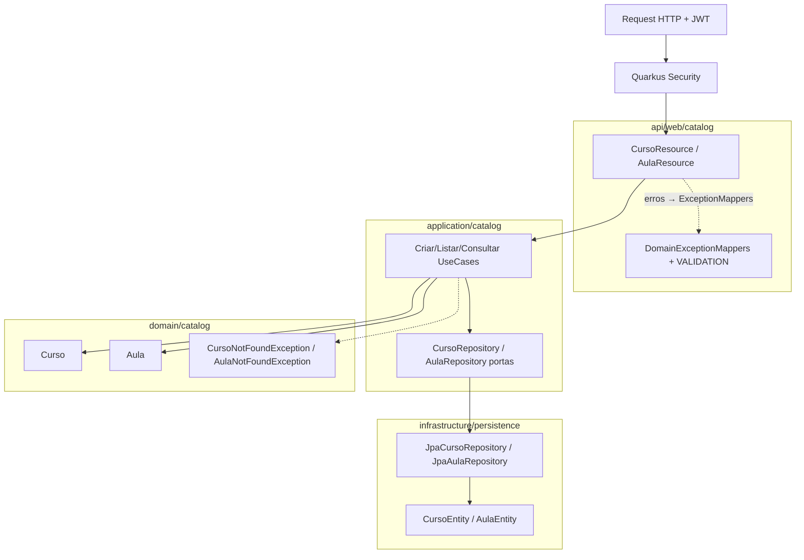

# Design — Módulo 02: Catálogo Curso/Aula

| Campo | Valor |
| --- | --- |
| **Módulo** | `02-catalogo-curso-aula` |
| **Stack** | Java 17, Quarkus 3.33 LTS, Hibernate ORM, Flyway, JAX-RS (`quarkus-rest-jackson`) |
| **Paradigma** | Hexagonal (ports & adapters) dentro do modular monolith |
| **Status** | Rascunho para revisão |
| **Depende de** | Módulo 01 (auth JWT + envelope de erro + `@RolesAllowed`) |

---

## 1. Visão arquitetural

O catálogo segue o mesmo corte do módulo 01 (AD-2): HTTP em `api`, orquestração em `application`, regras em `domain`, JPA/Flyway em `infrastructure`.



**Fluxo criar Curso:** `CursoResource` → `CriarCursoUseCase` → valida nome → persiste via `CursoRepository` → 201.

**Fluxo criar Aula:** `CursoResource` → `CriarAulaUseCase` → garante Curso existe → persiste Aula → 201; senão `CursoNotFoundException` → 404 `CURSO_NOT_FOUND`.

**Auth:** nenhuma mudança em claims, login ou códigos `AUTH_*`. Resources só declaram `@RolesAllowed` já usados nos stubs.

---

## 2. Decisão estrutural: `nome` vs `titulo`

| Fonte | Campo da Aula |
| --- | --- |
| PRD FR-3 / Spine Consistency | **`nome`** obrigatório |
| Stub `AulaResource` / `criarAula` / Postman atual | `titulo` (provisório) |

**Decisão:** contrato público da Aula usa **`nome`** (request e response). Remover `titulo` do stub e da collection Postman neste módulo.

*Por quê:* o stub existia só para provar `@RolesAllowed`; o PRD é a fonte de verdade funcional. Quebra deliberada e documentada do contrato provisório — não do módulo 01.

---

## 3. Endpoints

| Método | Path | Roles | Descrição |
| --- | --- | --- | --- |
| `POST` | `/api/v1/cursos` | `ADMINISTRADOR` | Cria Curso |
| `GET` | `/api/v1/cursos` | `ESTUDANTE`, `ADMINISTRADOR` | Lista Cursos |
| `GET` | `/api/v1/cursos/{id}` | `ESTUDANTE`, `ADMINISTRADOR` | Consulta Curso (**novo** — stub não tinha; FR-3/FR-4) |
| `POST` | `/api/v1/cursos/{cursoId}/aulas` | `ADMINISTRADOR` | Cria Aula no Curso |
| `GET` | `/api/v1/cursos/{cursoId}/aulas` | `ESTUDANTE`, `ADMINISTRADOR` | Lista Aulas do Curso |
| `GET` | `/api/v1/aulas/{id}` | `ESTUDANTE`, `ADMINISTRADOR` | Consulta Aula |

**Fora deste módulo (stub permanece):**

| Método | Path | Roles | Nota |
| --- | --- | --- | --- |
| `POST` | `/api/v1/cursos/{cursoId}/inscricoes` | `ESTUDANTE` | Stub inscrição — módulo Inscrição |

---

## 4. Estrutura de pacotes (proposta)

```text
com.fiap.feedbacks
├── api/web/catalog
│   ├── CursoResource.java
│   ├── AulaResource.java
│   └── dto
│       ├── CriarCursoRequest.java
│       ├── CursoResponse.java
│       ├── CriarAulaRequest.java
│       └── AulaResponse.java
├── application/catalog
│   ├── CriarCursoUseCase.java
│   ├── ListarCursosUseCase.java
│   ├── ConsultarCursoUseCase.java
│   ├── CriarAulaUseCase.java
│   ├── ListarAulasDoCursoUseCase.java
│   ├── ConsultarAulaUseCase.java
│   ├── port
│   │   ├── CursoRepository.java
│   │   └── AulaRepository.java
│   └── dto (commands/results se útil)
├── domain/catalog
│   ├── Curso.java
│   └── Aula.java
├── domain/exception
│   ├── CursoNotFoundException.java
│   └── AulaNotFoundException.java
└── infrastructure/persistence
    ├── CursoEntity.java
    ├── AulaEntity.java
    ├── CursoJpaRepository.java
    ├── AulaJpaRepository.java
    ├── JpaCursoRepository.java
    └── JpaAulaRepository.java
```

---

## 5. Modelo de domínio

### 5.1 `Curso`

| Atributo | Tipo | Regra |
| --- | --- | --- |
| `id` | `UUID` | Gerado na criação |
| `nome` | `String` | Obrigatório; trim; não vazio |
| `descricao` | `String` | Opcional; pode ser `null` |
| `criadoEm` | `Instant` | Preenchido na persistência (auditoria interna; opcional na API) |

### 5.2 `Aula`

| Atributo | Tipo | Regra |
| --- | --- | --- |
| `id` | `UUID` | Gerado na criação |
| `cursoId` | `UUID` | FK lógica; Curso deve existir |
| `nome` | `String` | Obrigatório; trim; não vazio |
| `descricao` | `String` | Opcional; pode ser `null` |
| `criadoEm` | `Instant` | Persistência |

Sem unicidade de `nome` no MVP. Sem update/delete.

---

## 6. Persistência — Flyway `V3`

**Não alterar** `V1__create_schema.sql` / `V2__seed_usuarios.sql` sem necessidade.

`V3__create_catalogo.sql` (nome sugerido):

```sql
CREATE TABLE curso (
    id          UUID PRIMARY KEY,
    nome        VARCHAR(255) NOT NULL,
    descricao   VARCHAR(1000),
    criado_em   TIMESTAMP WITH TIME ZONE NOT NULL DEFAULT CURRENT_TIMESTAMP
);

CREATE TABLE aula (
    id          UUID PRIMARY KEY,
    curso_id    UUID NOT NULL REFERENCES curso (id),
    nome        VARCHAR(255) NOT NULL,
    descricao   VARCHAR(1000),
    criado_em   TIMESTAMP WITH TIME ZONE NOT NULL DEFAULT CURRENT_TIMESTAMP
);

CREATE INDEX idx_aula_curso_id ON aula (curso_id);
```

> Seed de catálogo: **opcional**. Demo pode criar via Postman (UJ-2). Se houver seed, usar `V4__seed_catalogo.sql` separado — não misturar com auth.

---

## 7. DTOs HTTP

### `CriarCursoRequest` / `CriarAulaRequest`

| Campo | Tipo | Validação |
| --- | --- | --- |
| `nome` | `String` | `@NotBlank` |
| `descricao` | `String` | opcional (`null` ok) |

### `CursoResponse`

```json
{
  "id": "…",
  "nome": "Arquitetura Cloud",
  "descricao": "Curso introdutório"
}
```

### `AulaResponse`

```json
{
  "id": "…",
  "cursoId": "…",
  "nome": "Aula 1 — Containers",
  "descricao": "Docker e Kubernetes"
}
```

`descricao` omitida no create → serializar como `null` no response (Jackson default) — comportamento estável para Postman/asserts.

---

## 8. Portas e casos de uso

### 8.1 Portas

```java
public interface CursoRepository {
    Curso save(Curso curso);
    Optional<Curso> findById(UUID id);
    List<Curso> findAll();
}

public interface AulaRepository {
    Aula save(Aula aula);
    Optional<Aula> findById(UUID id);
    List<Aula> findByCursoId(UUID cursoId);
}
```

### 8.2 Casos de uso (resumo)

| Use case | Regra principal |
| --- | --- |
| `CriarCursoUseCase` | Persiste Curso; validação Bean Validation na borda HTTP |
| `ConsultarCursoUseCase` | `findById` ou `CursoNotFoundException` |
| `ListarCursosUseCase` | `findAll` (ordem estável: `criado_em` ASC ou `nome` ASC — fixar na implementação) |
| `CriarAulaUseCase` | Exige Curso; senão `CursoNotFoundException`; persiste Aula |
| `ListarAulasDoCursoUseCase` | Exige Curso; lista Aulas do `cursoId` |
| `ConsultarAulaUseCase` | `findById` ou `AulaNotFoundException` |

---

## 9. Tratamento de exceções

Estender o padrão do módulo 01 (`DomainException` + `ExceptionMapper`):

| Exceção | HTTP | code |
| --- | --- | --- |
| Bean Validation / constraint | 400 | `VALIDATION_ERROR` |
| `CursoNotFoundException` | 404 | `CURSO_NOT_FOUND` |
| `AulaNotFoundException` | 404 | `AULA_NOT_FOUND` |
| Quarkus Forbidden / Unauthorized | 403 / 401 | `AUTH_*` (já existentes) |

Não introduzir códigos genéricos `NOT_FOUND` — preferir códigos por agregado para facilitar asserts e Postman.

---

## 10. Testes (AD-14)

| Classe | Tipo | Cenários |
| --- | --- | --- |
| `CriarCursoUseCaseTest` / `CriarAulaUseCaseTest` | Unit | sucesso, curso ausente na aula |
| `Consultar*UseCaseTest` | Unit | encontrado / not found |
| `CursoCatalogResourceTest` | `@QuarkusTest` | 201, 200 list/get, 400, 403, 404 |
| `AulaCatalogResourceTest` | `@QuarkusTest` | create/list/get, `nome` no JSON, 404 |

Cobrir specs.md; meta JaCoCo ≥ 90% no código de produção deste módulo.

---

## 11. Postman / docs

Atualizar `docs/postman/feedbacks-api.postman_collection.json`:

- Body de criar Aula: `"nome"` (não `"titulo"`).
- Incluir request `GET /api/v1/cursos/{{cursoId}}` se ainda não existir.
- Scripts de env: capturar `cursoId` / `aulaId` dos 201 para o fluxo UJ-2.

Não alterar requests de login nem códigos `AUTH_*` esperados.

---

## 12. Decisões em aberto (defaults propostos)

| # | Questão | Proposta default |
| --- | --- | --- |
| 1 | Campo Aula `nome` vs `titulo` | **`nome`** (PRD) |
| 2 | `GET /cursos/{id}` | **Incluir** (FR-3/FR-4) |
| 3 | Seed Flyway de catálogo | **Não** no MVP (criar via API/Postman) |
| 4 | Ordem da listagem | `criado_em ASC` |
| 5 | Limite de tamanho `descricao` | `VARCHAR(1000)` |
| 6 | Stub inscrição | **Manter** sem lógica de domínio |

---

## 13. Fora deste design

- Inscrição Curso/Aula (FR-5/6).
- Avaliação, Urgência, filas, relatórios.
- Qualquer mudança em `AuthResource`, claims JWT ou mapa `AUTH_*`.
- CRUD completo (PUT/DELETE) de catálogo.
