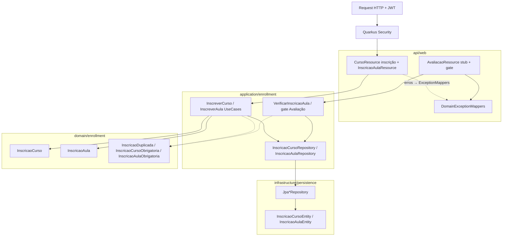

# Design — Módulo 03: Inscrição Curso/Aula

| Campo | Valor |
| --- | --- |
| **Módulo** | `03-inscricao-curso-aula` |
| **Stack** | Java 17, Quarkus 3.33 LTS, Hibernate ORM, Flyway, JAX-RS |
| **Paradigma** | Hexagonal (ports & adapters) dentro do modular monolith |
| **Status** | Rascunho para revisão |
| **Depende de** | Módulo 01 (JWT, `CurrentUserProvider`, envelope); Módulo 02 (`Curso`/`Aula`, `CURSO_NOT_FOUND`/`AULA_NOT_FOUND`) |
| **Spine** | AD-2, AD-3, AD-8, AD-9, AD-14, AD-15 |

---

## 1. Visão arquitetural



**Fluxo inscrição Curso:** Resource → `InscreverEmCursoUseCase` → valida Curso existe → UNIQUE `(estudante, curso)` → 201; duplicata → `InscricaoDuplicadaException` → 409.

**Fluxo inscrição Aula:** Resource → `InscreverEmAulaUseCase` → Curso existe → Aula existe e pertence ao Curso → inscrição Curso do estudante existe → UNIQUE `(estudante, aula)` → 201.

**Gate FR-6:** `AvaliacaoResource.criar` lê `aulaId` do body → `VerificarInscricaoAulaUseCase` (ou porta equivalente) com `CurrentUserProvider.getCurrentUserId()`; se false → `InscricaoAulaObrigatoriaException`; se true → comportamento stub atual (sem FR-7).

**Auth:** nenhuma mudança em claims, login ou códigos `AUTH_*`.

---

## 2. Endpoints

| Método | Path | Roles | Descrição |
| --- | --- | --- | --- |
| `POST` | `/api/v1/cursos/{cursoId}/inscricoes` | `ESTUDANTE` | Inscreve no Curso (substitui stub) |
| `POST` | `/api/v1/cursos/{cursoId}/aulas/{aulaId}/inscricoes` | `ESTUDANTE` | Inscreve na Aula (**novo**) |
| `POST` | `/avaliacao` | `ESTUDANTE` | Stub + **gate FR-6** (sem persistir Avaliação real) |

Sem GET de inscrição no MVP.

---

## 3. Estrutura de pacotes (proposta)

```text
com.fiap.feedbacks
├── api/web/catalog
│   └── CursoResource.java          # método inscrever → use case real
├── api/web/enrollment              # opcional: resource dedicado da Aula
│   ├── InscricaoAulaResource.java  # POST .../aulas/{aulaId}/inscricoes
│   └── dto
│       ├── InscricaoCursoResponse.java
│       └── InscricaoAulaResponse.java
├── api/web/avaliacao
│   └── AvaliacaoResource.java      # gate antes do stub 201
├── application/enrollment
│   ├── InscreverEmCursoUseCase.java
│   ├── InscreverEmAulaUseCase.java
│   ├── VerificarInscricaoAulaUseCase.java
│   └── port
│       ├── InscricaoCursoRepository.java
│       └── InscricaoAulaRepository.java
├── domain/enrollment
│   ├── InscricaoCurso.java
│   └── InscricaoAula.java
├── domain/exception
│   ├── InscricaoDuplicadaException.java
│   ├── InscricaoCursoObrigatoriaException.java
│   └── InscricaoAulaObrigatoriaException.java
└── infrastructure/persistence
    ├── InscricaoCursoEntity.java
    ├── InscricaoAulaEntity.java
    └── Jpa* adapters
```

Reutilizar portas/repositórios de catálogo (`CursoRepository` / `AulaRepository`) para existence checks — não duplicar entidades Curso/Aula.

---

## 4. Modelo de domínio

### 4.1 `InscricaoCurso`

| Atributo | Tipo | Regra |
| --- | --- | --- |
| `id` | `UUID` | Gerado na criação |
| `estudanteId` | `UUID` | `sub` do JWT |
| `cursoId` | `UUID` | Curso deve existir |
| `criadoEm` | `Instant` | Persistência |

UNIQUE `(estudante_id, curso_id)`.

### 4.2 `InscricaoAula`

| Atributo | Tipo | Regra |
| --- | --- | --- |
| `id` | `UUID` | Gerado na criação |
| `estudanteId` | `UUID` | `sub` do JWT |
| `aulaId` | `UUID` | Aula deve existir e pertencer ao Curso do path |
| `cursoId` | `UUID` | Denormalizado do path/Aula (facilita queries / AD-15) |
| `criadoEm` | `Instant` | Persistência |

UNIQUE `(estudante_id, aula_id)`. Pré-condição: existe `InscricaoCurso` para `(estudanteId, cursoId)`.

---

## 5. Persistência — Flyway `V4`

**Não alterar** V1–V3.

`V4__create_inscricao.sql` (nome sugerido):

```sql
CREATE TABLE inscricao_curso (
    id            UUID PRIMARY KEY,
    estudante_id  UUID NOT NULL REFERENCES usuario (id),
    curso_id      UUID NOT NULL REFERENCES curso (id),
    criado_em     TIMESTAMP WITH TIME ZONE NOT NULL DEFAULT CURRENT_TIMESTAMP,
    CONSTRAINT uq_inscricao_curso_estudante_curso UNIQUE (estudante_id, curso_id)
);

CREATE TABLE inscricao_aula (
    id            UUID PRIMARY KEY,
    estudante_id  UUID NOT NULL REFERENCES usuario (id),
    aula_id       UUID NOT NULL REFERENCES aula (id),
    curso_id      UUID NOT NULL REFERENCES curso (id),
    criado_em     TIMESTAMP WITH TIME ZONE NOT NULL DEFAULT CURRENT_TIMESTAMP,
    CONSTRAINT uq_inscricao_aula_estudante_aula UNIQUE (estudante_id, aula_id)
);

CREATE INDEX idx_inscricao_curso_estudante ON inscricao_curso (estudante_id);
CREATE INDEX idx_inscricao_aula_estudante ON inscricao_aula (estudante_id);
CREATE INDEX idx_inscricao_aula_aula ON inscricao_aula (aula_id);
```

> Confirmar nome da tabela/coluna de usuário em V1 (`usuario` / `id`) antes de fechar o SQL.

---

## 6. DTOs HTTP

### Request inscrição Curso / Aula

Sem body (ou body vazio `{}`). Identidade vem do JWT; ids vêm do path.

### `InscricaoCursoResponse`

```json
{
  "id": "…",
  "cursoId": "…",
  "estudanteId": "…"
}
```

### `InscricaoAulaResponse`

```json
{
  "id": "…",
  "cursoId": "…",
  "aulaId": "…",
  "estudanteId": "…"
}
```

### Gate em `POST /avaliacao` (stub)

Request mínimo para o gate (sem fechar contrato FR-7):

```json
{
  "aulaId": "…",
  "descricao": "opcional no stub"
}
```

Ausência de `aulaId` → `400 VALIDATION_ERROR`. Sem inscrição → `403` + `INSCRICAO_AULA_OBRIGATORIA` (default; ver §9).

---

## 7. Portas e casos de uso

```java
public interface InscricaoCursoRepository {
    InscricaoCurso save(InscricaoCurso inscricao);
    boolean existsByEstudanteIdAndCursoId(UUID estudanteId, UUID cursoId);
}

public interface InscricaoAulaRepository {
    InscricaoAula save(InscricaoAula inscricao);
    boolean existsByEstudanteIdAndAulaId(UUID estudanteId, UUID aulaId);
}
```

| Use case | Regra principal |
| --- | --- |
| `InscreverEmCursoUseCase` | Curso existe; senão duplicata; persiste |
| `InscreverEmAulaUseCase` | Curso + Aula (mesmo curso) + inscrição Curso; senão duplicata Aula |
| `VerificarInscricaoAulaUseCase` | `existsByEstudanteIdAndAulaId` — usado pelo gate FR-6 e futuro FR-7 |

---

## 8. Tratamento de exceções

| Exceção | HTTP | code |
| --- | --- | --- |
| Bean Validation | 400 | `VALIDATION_ERROR` |
| `CursoNotFoundException` | 404 | `CURSO_NOT_FOUND` |
| `AulaNotFoundException` | 404 | `AULA_NOT_FOUND` |
| `InscricaoDuplicadaException` | 409 | `INSCRICAO_DUPLICADA` |
| `InscricaoCursoObrigatoriaException` | 409 | `INSCRICAO_CURSO_OBRIGATORIA` |
| `InscricaoAulaObrigatoriaException` | 403 | `INSCRICAO_AULA_OBRIGATORIA` |
| Quarkus Forbidden / Unauthorized | 403 / 401 | `AUTH_*` (existentes) |

**Por quê 403 no gate FR-6:** o Estudante está autenticado, mas não autorizado a avaliar aquela Aula sem vínculo — distinto de duplicata (409) e de not found (404).  
**Por quê 409 na pré-condição Curso→Aula:** conflito de estado de domínio (ordem de inscrição), alinhado a AD-15 / review adversarial.

Mapear também violação UNIQUE do Hibernate → `INSCRICAO_DUPLICADA` (corrida).

---

## 9. Testes (AD-14)

| Classe | Tipo | Cenários |
| --- | --- | --- |
| `InscreverEmCursoUseCaseTest` | Unit | sucesso, curso ausente, duplicata |
| `InscreverEmAulaUseCaseTest` | Unit | sucesso, sem inscrição curso, aula outro curso, duplicata |
| `VerificarInscricaoAulaUseCaseTest` | Unit | true/false |
| `InscricaoResourceTest` | `@QuarkusTest` | SPEC-5.x HTTP + 401/403 auth |
| `AvaliacaoGateInscricaoTest` | `@QuarkusTest` | SPEC-6.1 / 6.2 |

Adaptar testes de auth SPEC-2.9 que hoje batem no stub sem Curso: criar Curso (e Aula/inscrições quando necessário) no arrange.

Meta JaCoCo ≥ 90% no código de produção deste módulo.

---

## 10. Postman / docs

Atualizar `docs/postman/feedbacks-api.postman_collection.json`:

- Request “Inscrever em curso”: descrição real (não stub); assert 201 / 409.
- Novo request “Inscrever em aula” com `{{cursoId}}` / `{{aulaId}}`.
- Ajustar fluxo UJ-1: login Estudante → (catálogo) → inscrição Curso → inscrição Aula → (avaliação gate).
- Não alterar requests de login nem códigos `AUTH_*`.

---

## 11. Decisões em aberto (defaults propostos)

| # | Questão | Proposta default |
| --- | --- | --- |
| 1 | Path inscrição Aula | `POST /api/v1/cursos/{cursoId}/aulas/{aulaId}/inscricoes` |
| 2 | Body nas POSTs de inscrição | **Vazio** (ids no path + JWT) |
| 3 | Duplicata | **409** `INSCRICAO_DUPLICADA` (não idempotente) |
| 4 | Aula sem inscrição no Curso | **409** `INSCRICAO_CURSO_OBRIGATORIA` |
| 5 | Gate FR-6 HTTP | **403** `INSCRICAO_AULA_OBRIGATORIA` |
| 6 | Implementar FR-7 neste módulo | **Não** — só gate no stub |
| 7 | Listagem HTTP de inscrição | **Não** no MVP |
| 8 | `curso_id` em `inscricao_aula` | **Sim** (denormalizado) |

---

## 12. Fora deste design

- Persistência completa de Avaliação, Urgência, publish SQS (FR-7+).
- Update/Delete de inscrição.
- Qualquer mudança em `AuthResource`, claims JWT ou mapa `AUTH_*`.
- Alteração de contrato/schema de Curso/Aula (módulo 02).
- Alertas, relatórios, observabilidade.
