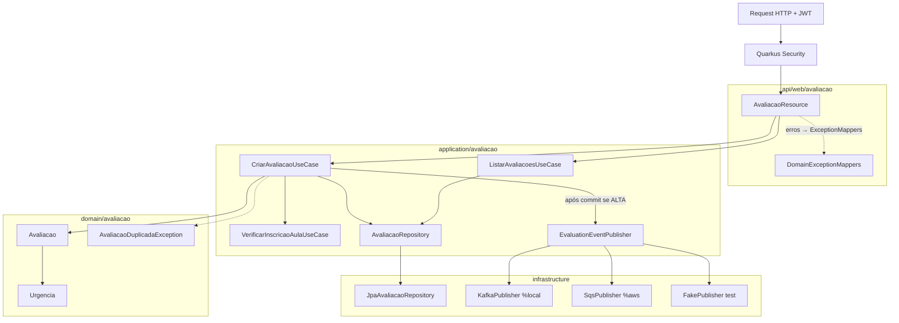

# Design — Módulo 04: Avaliação de Aula

| Campo | Valor |
| --- | --- |
| **Módulo** | `04-avaliacao-aula` |
| **Stack** | Java 17, Quarkus 3.33 LTS, Hibernate ORM, Flyway, JAX-RS |
| **Paradigma** | Hexagonal (ports & adapters) dentro do modular monolith |
| **Status** | Rascunho para revisão |
| **Depende de** | 01 (JWT, envelope); 02 (`Aula`/`Curso`); 03 (`VerificarInscricaoAula`) |
| **Spine** | AD-2, AD-3, AD-4, AD-5, AD-7, AD-8, AD-9, AD-14, AD-15, AD-16, AD-18 |

---

## 1. Visão arquitetural



**Fluxo criar:** Resource → `CriarAvaliacaoUseCase` → gate inscrição → resolve Aula (`cursoId`) →
valida nota/descricao → UNIQUE → persiste com Urgência → **após commit** se ALTA → publish AD-5.

**Auth:** sem mudança em claims, login ou `AUTH_*`.

---

## 2. Endpoints

| Método | Path | Roles | Descrição |
| --- | --- | --- | --- |
| `POST` | `/avaliacao` | `ESTUDANTE` | Cria Avaliação real (substitui stub) |
| `GET` | `/avaliacao` | `ESTUDANTE`, `ADMINISTRADOR` | Lista enriquecida (escopo por papel) |

---

## 3. Pacotes

```text
com.fiap.feedbacks
├── api/web/avaliacao
│   ├── AvaliacaoResource.java
│   └── dto/{CriarAvaliacaoRequest,AvaliacaoResponse}.java
├── application/avaliacao
│   ├── CriarAvaliacaoUseCase.java
│   ├── ListarAvaliacoesUseCase.java
│   ├── AvaliacaoReadRepository.java          # evoluir
│   └── port/{AvaliacaoRepository,EvaluationEventPublisher}.java
├── domain/avaliacao
│   ├── Avaliacao.java
│   └── Urgencia.java                         # ALTA | MEDIA | BAIXA
├── domain/exception
│   └── AvaliacaoDuplicadaException.java
└── infrastructure
    ├── persistence/{AvaliacaoEntity,JpaAvaliacaoRepository}.java
    └── messaging/{KafkaEvaluationEventPublisher,SqsEvaluationEventPublisher,Fake...}.java
```

Reutilizar `VerificarInscricaoAulaUseCase` e `AulaRepository` — não duplicar.

---

## 4. Modelo de domínio

### 4.1 `Urgencia`

| Faixa de `nota` | Valor |
| --- | --- |
| ≤ 4 | `ALTA` |
| 5–7 | `MEDIA` |
| ≥ 8 | `BAIXA` |

### 4.2 `Avaliacao`

| Atributo | Tipo | Regra |
| --- | --- | --- |
| `id` | `UUID` | Gerado na criação |
| `estudanteId` | `UUID` | `sub` do JWT |
| `aulaId` | `UUID` | Aula existente; inscrição obrigatória |
| `cursoId` | `UUID` | Derivado da Aula (denormalizado) |
| `descricao` | `String` | Não blank; limite alinhado VARCHAR(500) |
| `nota` | `int` | 0–10 inclusive |
| `urgencia` | `Urgencia` | Derivada da nota |
| `ocorridoEm` | `Instant` | Momento da criação |

UNIQUE `(estudante_id, aula_id)`.

---

## 5. Persistência — Flyway `V5`

**Não alterar** V1–V4. Evoluir tabela criada em V1:

```sql
ALTER TABLE avaliacao
    ADD COLUMN aula_id UUID REFERENCES aula (id),
    ADD COLUMN curso_id UUID REFERENCES curso (id),
    ADD COLUMN nota SMALLINT,
    ADD COLUMN urgencia VARCHAR(10),
    ADD COLUMN ocorrido_em TIMESTAMP WITH TIME ZONE;

-- Em ambientes limpos (dev/test) as linhas seed de avaliacao não existem;
-- tornar NOT NULL + CHECKs + UNIQUE após ADD (ou em statements seguintes):
ALTER TABLE avaliacao
    ALTER COLUMN aula_id SET NOT NULL,
    ALTER COLUMN curso_id SET NOT NULL,
    ALTER COLUMN nota SET NOT NULL,
    ALTER COLUMN urgencia SET NOT NULL,
    ALTER COLUMN ocorrido_em SET NOT NULL;

ALTER TABLE avaliacao
    ADD CONSTRAINT chk_avaliacao_nota CHECK (nota BETWEEN 0 AND 10),
    ADD CONSTRAINT chk_avaliacao_urgencia CHECK (urgencia IN ('ALTA', 'MEDIA', 'BAIXA')),
    ADD CONSTRAINT uq_avaliacao_estudante_aula UNIQUE (estudante_id, aula_id);

CREATE INDEX idx_avaliacao_ocorrido_em ON avaliacao (ocorrido_em);
CREATE INDEX idx_avaliacao_aula ON avaliacao (aula_id);
```

> Se houver linhas legadas de demo sem `aula_id`, truncar ou migrar antes dos NOT NULL — no
> MVP acadêmico o banco de teste é recriado pelo Flyway.

---

## 6. DTOs HTTP

### `CriarAvaliacaoRequest`

```json
{
  "aulaId": "…",
  "descricao": "Aula rápida demais",
  "nota": 3
}
```

### `AvaliacaoResponse` (201 / itens do GET)

```json
{
  "id": "…",
  "estudanteId": "…",
  "aulaId": "…",
  "cursoId": "…",
  "descricao": "Aula rápida demais",
  "nota": 3,
  "urgencia": "ALTA",
  "ocorridoEm": "2026-07-22T14:30:00-03:00"
}
```

---

## 7. Portas e casos de uso

```java
public interface AvaliacaoRepository {
    Avaliacao save(Avaliacao avaliacao);
    boolean existsByEstudanteIdAndAulaId(UUID estudanteId, UUID aulaId);
    List<Avaliacao> findAll();
    List<Avaliacao> findByEstudanteId(UUID estudanteId);
}

public interface EvaluationEventPublisher {
    void publish(AvaliacaoAlertaEvent event); // AD-5 JSON
}
```

`CriarAvaliacaoUseCase`: orquestra gate + domínio + save + publish pós-TX.  
`ListarAvaliacoesUseCase`: Admin → `findAll`; Estudante → `findByEstudanteId(sub)`.

---

## 8. Exceções → HTTP

| Exceção | HTTP | code |
| --- | --- | --- |
| Bean Validation | 400 | `VALIDATION_ERROR` |
| `AulaNotFoundException` | 404 | `AULA_NOT_FOUND` |
| `InscricaoAulaObrigatoriaException` | 403 | `INSCRICAO_AULA_OBRIGATORIA` |
| `AvaliacaoDuplicadaException` | 409 | `AVALIACAO_DUPLICADA` |
| Papel insuficiente | 403 | `AUTH_FORBIDDEN` |

---

## 9. Evento de alerta (AD-5)

```json
{
  "avaliacaoId": "…",
  "descricao": "…",
  "urgencia": "ALTA",
  "ocorridoEm": "2026-07-22T14:30:00-03:00",
  "aulaId": "…",
  "cursoId": "…"
}
```

Só `ALTA`. Adapters: fake (test), Kafka (`%local`), SQS (`%aws` — no-op seguro se fila
ainda não existir, logando e não falhando a API). Fault Tolerance na borda (AD-18).

---

## 10. Testes

| Tipo | Cobertura |
| --- | --- |
| Unit | `Urgencia` fronteiras; `CriarAvaliacaoUseCase` (mocks repo/gate/publisher) |
| `@QuarkusTest` | SPEC-7.x, 8.x, 9.x, 6.1, 10prep com fake publisher |
| Regressão | SPEC-2.6/2.7/2.10/2.11 com payload real |

JaCoCo ≥ 90% no código deste módulo (AD-14).

---

## 11. Postman

- Atualizar request `POST /avaliacao` com `nota`.
- UJ-1: login Estudante → catálogo → inscrição Curso → inscrição Aula → Avaliação (ex. nota 3).
- Request opcional de listagem Admin após criação.

---

## 12. Defaults fechados

| Tema | Default |
| --- | --- |
| Body | `aulaId` + `descricao` + `nota` (não path) |
| Urgência JSON | `ALTA` \| `MEDIA` \| `BAIXA` (sem acento) |
| Duplicata | 409, sem upsert |
| Publish | pós-commit, só ALTA |
| FR-10 | fora — só porta/evento |
