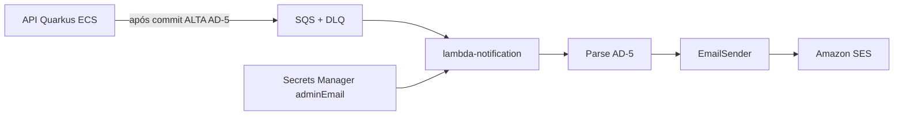

# Design — Módulo 05: Alerta SES (Lambda)

| Campo | Valor |
| --- | --- |
| **Módulo** | `05-alerta-ses` |
| **Stack** | Java 17, Quarkus 3.33 LTS, `quarkus-amazon-lambda`, AWS SDK SES/SQS v2 |
| **Paradigma** | Async side effect SRP (Lambda); porta `EmailSender` |
| **Status** | Implementado (CDK Java em `feedbacks/infra`; app em `feedbacks/apps/notification`) |
| **Depende de** | 04 (publish AD-5 / `EvaluationEventPublisher`) |
| **Spine** | AD-1, AD-4, AD-5, AD-7, AD-12, AD-13, AD-14, AD-17, AD-18 |

---

## 1. Visão arquitetural



**Local:** API pode publicar Kafka (`%local`); validação da Lambda = unitários + fake SES.
**AWS:** API SQS publisher → fila → Lambda → SES (sandbox).

---

## 2. Pacotes (`feedbacks/apps/notification`)

```text
com.fiap.feedbacks.lambda.notification
├── handler/AlertSqsHandler.java          # entrada SQS
├── application/
│   ├── ProcessAlertUseCase.java
│   └── port/EmailSender.java
├── domain/AlertPayload.java              # campos AD-5
└── infrastructure/
    ├── SesEmailSender.java
    └── FakeEmailSender.java              # testes
```

---

## 3. Contrato AD-5 (consumo)

| Campo | Tipo JSON | Uso no e-mail |
| --- | --- | --- |
| `avaliacaoId` | string UUID | correlação / log |
| `descricao` | string | corpo |
| `urgencia` | `"ALTA"` | corpo + subject |
| `ocorridoEm` | ISO-8601 offset | corpo (data) |
| `aulaId` | string UUID | log opcional |
| `cursoId` | string UUID | log opcional |

---

## 4. Configuração

| Chave | Origem | Uso |
| --- | --- | --- |
| `ADMIN_EMAIL` / secret `adminEmail` | env / SM | destinatário SES |
| `QUARKUS_LAMBDA_*` | Quarkus | handler packaging |
| API: `feedbacks.messaging.sqs.queue-url` | `%aws` | publisher real |

---

## 5. CDK mínimo (`feedbacks/infra`) — Java

- Maven + AWS CDK v2 (`software.amazon.awscdk`), Java 17 — sem TypeScript/Node no IaC.
- Queue + DLQ + redrive.
- Function a partir de `function.zip` do módulo notification.
- Event source SQS → Lambda.
- Policy `ses:SendEmail` (+ identidade verificada na conta).
- Read secret `adminEmail` → env da Lambda.

Fora: ECS, RDS, `lambda-report`, EventBridge.

---

## 6. Testes

- Unit: parse válido → `EmailSender` 1×; parse inválido → 0× SES; subject/body contêm
  descrição/urgência/data.
- Fixture JSON alinhada aos testes do publisher da API.
- JaCoCo ≥ 90% (AD-14) no módulo notification.

---

## 7. Critérios de aceite (espelho proposal §6)

Ver checkboxes em `openspec/modules/05-alerta-ses/proposal.md` §6.
