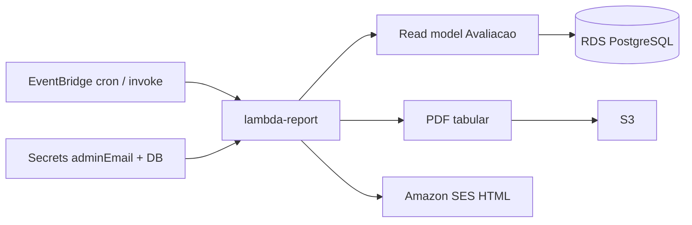

# Design — Módulo 06: Relatórios periódicos (Lambda)

| Campo | Valor |
| --- | --- |
| **Módulo** | `06-relatorios` |
| **Stack** | Java 17, Quarkus 3.33 LTS, `quarkus-amazon-lambda`, JDBC/ORM read-only, SES, S3 |
| **Paradigma** | Job serverless SRP; portas read model / e-mail / PDF store |
| **Status** | Implementado (UJ-4 demo com JDBC + seed) |
| **Depende de** | 04 (Avaliação); secrets/SES do 05 |
| **Spine** | AD-1, AD-3, AD-6, AD-10, AD-12, AD-13, AD-14, AD-16, AD-17, AD-18 |

---

## 1. Visão arquitetural



### Envelope de rede (demo vs alvo AD-17)

| Modo | Lambda report | RDS | Quando usar |
| --- | --- | --- | --- |
| **Demo acadêmico (custo)** | VPC default (subnets públicas + `allowPublicSubnet`); SG `feedbacks-report-lambda`; secret `feedbacks/db`; `FEEDBACKS_DB_SECRET_NAME` | Público (`PubliclyAccessible`); SG do RDS autoriza SG da Lambda (+ ECS) | Conta sem NAT/subnets privadas; prazo/teardown |
| **Alvo AD-17** | VPC privada + SG → :5432 | Privado, sem IP público | Quando houver private + egress (NAT ou endpoints) |

Sem secret DB: `FEEDBACKS_REPORT_JDBC_ENABLED=false` → read model vazio (SPEC-12.5 zeros).
Com secret: JDBC on + agregados reais + lista Descrição/Urgência/Data.
---

## 2. Pacotes (`feedbacks/apps/report`)

```text
com.fiap.feedbacks.lambda.report
├── handler/ReportHandler.java
├── application/
│   ├── GenerateReportUseCase.java
│   └── port/{AvaliacaoReadModel,ReportEmailSender,ReportPdfStore}.java
├── domain/{Periodo,ReportWindow,ReportAggregates}.java
└── infrastructure/
    ├── Jdbc/Orm read model
    ├── SesReportEmailSender
    ├── S3ReportPdfStore
    └── Fake* (testes)
```

---

## 3. Input e janelas

| Campo | Valores |
| --- | --- |
| `periodo` | `diario` \| `semanal` |
| Fuso | `America/Sao_Paulo` |
| Âncora | `ocorrido_em` |
| Diário | dia civil anterior |
| Semanal | 7 dias civis anteriores ao dia do disparo |

---

## 4. S3 e e-mail

| Concern | Convenção |
| --- | --- |
| Key | `relatorios/<periodo>/yyyy-MM-dd/<uuid>.pdf` |
| SES | HTML com tipo + período + agregados + tabela Descrição/Urgência/Data de envio; `adminEmail` |
| PDF | Mesmos agregados + lista individual (Descrição \| Urgência \| Data de envio) |
| Demo | `aws lambda invoke` com `periodo` (AD-10) |

---

## 5. CDK (`feedbacks/infra`) — Java

- Bucket S3; EventBridge: diário 08:00 SP; segunda 08:00 SP; IAM SES + S3 + secrets.
- JDBC: env `FEEDBACKS_DB_SECRET_NAME` → `DB_*` + `FEEDBACKS_REPORT_JDBC_ENABLED=true`.
- Rede demo: Lambda na VPC default com SG `feedbacks-report-lambda` (não usa
  `FEEDBACKS_REPORT_VPC_ID` / Lambda fora de VPC). Após `harden-rds-sg`, ingress RDS
  via SGs da Lambda e das tasks ECS — sem `0.0.0.0/0`.
- Seed demo: `feedbacks/infra/scripts/seed-report-demo.sql` (avaliações nos últimos 7 dias SP).
- Fora: ECS/ECR pipeline (FR-15); alterar SRP do alerta.

---

## 6. Testes

- Unit: janelas (fronteira SP); agregados diário/semanal; lista Descrição/Urgência/Data;
  HTML/PDF ports; período vazio → entrega zeros; `periodo` inválido → falha clara.
- JaCoCo ≥ 90% (AD-14).

---

## 7. Critérios de aceite

Ver checkboxes em `openspec/modules/06-relatorios/proposal.md` §6.
