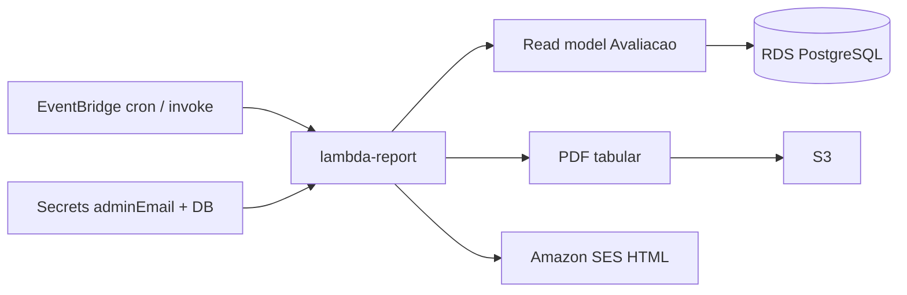

# Design — Módulo 06: Relatórios periódicos (Lambda)

| Campo | Valor |
| --- | --- |
| **Módulo** | `06-relatorios` |
| **Stack** | Java 17, Quarkus 3.33 LTS, `quarkus-amazon-lambda`, JDBC/ORM read-only, SES, S3 |
| **Paradigma** | Job serverless SRP; portas read model / e-mail / PDF store |
| **Status** | Em proposta |
| **Depende de** | 04 (Avaliação); secrets/SES do 05 |
| **Spine** | AD-1, AD-3, AD-6, AD-10, AD-12, AD-13, AD-14, AD-16, AD-17, AD-18 |

---

## 1. Visão arquitetural



---

## 2. Pacotes (`feedbacks/apps/report`)

```text
com.fiap.feedbacks.lambda.report
├── handler/ReportHandler.java
├── application/
│   ├── GenerateReportUseCase.java
│   └── port/{AvaliacaoReadModel,ReportEmailSender,ReportPdfStore}.java
├── domain/{Periodo,ReportWindow,ReportAggregates}.java
└── infrastructure/
    ├── Jdbc/Orm read model
    ├── SesReportEmailSender
    ├── S3ReportPdfStore
    └── Fake* (testes)
```

---

## 3. Input e janelas

| Campo | Valores |
| --- | --- |
| `periodo` | `diario` \| `semanal` |
| Fuso | `America/Sao_Paulo` |
| Âncora | `ocorrido_em` |
| Diário | dia civil anterior |
| Semanal | 7 dias civis anteriores ao dia do disparo |

---

## 4. S3 e e-mail

| Concern | Convenção |
| --- | --- |
| Key | `relatorios/<periodo>/yyyy-MM-dd/<uuid>.pdf` |
| SES | HTML com tipo + período + agregados; `adminEmail` |
| Demo | `aws lambda invoke` com `periodo` (AD-10) |

---

## 5. CDK (`feedbacks/infra`) — Java

- Bucket S3; Lambda report na VPC; SG → RDS:5432.
- EventBridge: diário 08:00 SP; segunda 08:00 SP.
- IAM SES + S3 + secrets.
- Fora: ECS/ECR pipeline (FR-15); alterar SRP do alerta.

---

## 6. Testes

- Unit: janelas (fronteira SP); agregados diário/semanal; HTML/PDF ports;
  período vazio → entrega zeros; `periodo` inválido → falha clara.
- JaCoCo ≥ 90% (AD-14).

---

## 7. Critérios de aceite

Ver checkboxes em `openspec/modules/06-relatorios/proposal.md` §6.
